# Sơ Đồ Cơ Sở Dữ Liệu (Database Schema) — CHÍNH THỨC

> **Dự án:** ERP Chuỗi Cửa Hàng Tiện Lợi  
> **Mô hình:** Hub & Spoke (Kho Tổng + Cửa hàng bán lẻ)  
> **Quy ước đặt tên:** Tiếng Việt không dấu, phân cách bằng dấu gạch dưới  
> **Tổng số bảng:** 22  
> **Phiên bản:** FINAL  

---

## MỤC LỤC

| # | Bảng | Thuộc Khối |
|:--|:---|:---|
| 1 | `chi_nhanh` | Trung tâm |
| 2 | `nhan_vien` | Nhân sự & Lương |
| 3 | `cham_cong` | Nhân sự & Lương |
| 4 | `bang_luong` | Nhân sự & Lương |
| 5 | `danh_muc` | Hàng hóa |
| 6 | `san_pham` | Hàng hóa |
| 7 | `ton_kho` | Kho hàng |
| 8 | `the_kho` | Kho hàng |
| 9 | `phieu_kiem_ke` | Kiểm kê |
| 10 | `chi_tiet_kiem_ke` | Kiểm kê |
| 11 | `khach_hang` | Bán hàng (POS) & CRM |
| 12 | `khuyen_mai` | Bán hàng (POS) & CRM |
| 13 | `hoa_don` | Bán hàng (POS) & CRM |
| 14 | `chi_tiet_hoa_don` | Bán hàng (POS) & CRM |
| 15 | `nha_cung_cap` | Mua hàng & Nhập kho |
| 16 | `phieu_nhap` | Mua hàng & Nhập kho |
| 17 | `chi_tiet_phieu_nhap` | Mua hàng & Nhập kho |
| 18 | `phieu_yeu_cau_nhap_hang` | Luân chuyển nội bộ |
| 19 | `chi_tiet_phieu_yeu_cau` | Luân chuyển nội bộ |
| 20 | `phieu_xuat_kho` | Luân chuyển nội bộ |
| 21 | `chi_tiet_phieu_xuat` | Luân chuyển nội bộ |
| 22 | `so_quy` | Tài chính |

---

## SƠ ĐỒ ERD

```mermaid
erDiagram
    %% KHỐI 1: TRUNG TÂM
    CHI_NHANH {
        uuid id PK
        string ten_chi_nhanh
        string dia_chi
        string loai "KHO_TONG | CUA_HANG_BAN_LE"
        boolean dang_hoat_dong
        datetime ngay_tao
    }

    %% KHỐI 2: NHÂN SỰ & LƯƠNG
    NHAN_VIEN {
        uuid id PK
        uuid id_chi_nhanh FK
        string ten_dang_nhap "Unique"
        string mat_khau
        string ho_ten
        string so_dien_thoai
        string vai_tro "ADMIN | KE_TOAN | THU_KHO | QUAN_LY | THU_NGAN"
        decimal luong_theo_gio
        string so_tai_khoan
        string ten_ngan_hang
        boolean dang_hoat_dong
        datetime ngay_tao
    }

    CHAM_CONG {
        uuid id PK
        uuid id_nhan_vien FK
        datetime gio_vao
        datetime gio_ra
        decimal tong_gio
        string ghi_chu
    }

    BANG_LUONG {
        uuid id PK
        uuid id_nhan_vien FK
        string thang_nam
        decimal tong_gio_lam
        decimal gio_dieu_chinh
        string ly_do_dieu_chinh
        decimal luong_theo_gio
        decimal tong_tien_luong
        string trang_thai "CHO_XAC_NHAN | DA_XAC_NHAN | DA_THANH_TOAN"
        uuid id_nguoi_xac_nhan FK
        uuid id_nguoi_duyet_chi FK
        datetime ngay_tao
        datetime ngay_xac_nhan
        datetime ngay_thanh_toan
    }

    %% KHỐI 3: HÀNG HÓA
    DANH_MUC {
        uuid id PK
        string ten_danh_muc
        datetime ngay_tao
    }

    SAN_PHAM {
        uuid id PK
        uuid id_danh_muc FK
        string ma_vach "Unique"
        string ten_san_pham
        decimal gia_von
        decimal gia_ban
        boolean dang_hoat_dong
        datetime ngay_tao
    }

    %% KHỐI 4: KHO HÀNG
    TON_KHO {
        uuid id_san_pham PK_FK
        uuid id_chi_nhanh PK_FK
        int so_luong_ton
    }

    THE_KHO {
        uuid id PK
        uuid id_san_pham FK
        uuid id_chi_nhanh FK
        string loai_giao_dich "NHAP_NCC | XUAT_CHI_NHANH | NHAN_TU_KHO | BAN_HANG | CAN_BANG_KIEM_KE | HAO_HUT"
        int so_luong
        string ma_chung_tu
        string ghi_chu
        datetime ngay_tao
    }

    %% KHỐI 5: KIỂM KÊ KHO
    PHIEU_KIEM_KE {
        uuid id PK
        uuid id_chi_nhanh FK
        uuid id_nguoi_tao FK
        string trang_thai "DANG_KIEM_KE | DA_CAN_BANG"
        string ghi_chu
        datetime ngay_tao
    }

    CHI_TIET_KIEM_KE {
        uuid id PK
        uuid id_phieu_kiem_ke FK
        uuid id_san_pham FK
        int ton_he_thong
        int ton_thuc_te
        int so_luong_lech
        string ly_do_lech
    }

    %% KHỐI 6: KHÁCH HÀNG & KHUYẾN MÃI
    KHACH_HANG {
        uuid id PK
        string ten_khach_hang
        string so_dien_thoai "Unique"
        datetime ngay_tao
    }

    KHUYEN_MAI {
        uuid id PK
        string ma_khuyen_mai "Unique, VD: SALE10, MINUS50K"
        string ten_khuyen_mai
        string loai_giam_gia "PHAN_TRAM | TIEN_MAT"
        decimal gia_tri_giam
        decimal don_hang_toi_thieu
        datetime ngay_bat_dau
        datetime ngay_ket_thuc
        boolean dang_hoat_dong
    }

    %% KHỐI 7: BÁN HÀNG (POS)
    HOA_DON {
        uuid id PK
        uuid id_chi_nhanh FK
        uuid id_thu_ngan FK
        uuid id_khach_hang FK "Nullable"
        uuid id_khuyen_mai FK "Nullable"
        decimal tong_tien_hang
        decimal tien_giam_gia "Tien duoc giam tu Khuyen mai"
        decimal tong_thanh_toan "= tong_tien_hang - tien_giam_gia"
        string hinh_thuc_tt "TIEN_MAT | CHUYEN_KHOAN"
        decimal tien_khach_dua
        decimal tien_thoi
        datetime ngay_tao
    }

    CHI_TIET_HOA_DON {
        uuid id PK
        uuid id_hoa_don FK
        uuid id_san_pham FK
        int so_luong
        decimal don_gia
        decimal thanh_tien
    }

    %% KHỐI 8: MUA HÀNG & NHẬP KHO
    NHA_CUNG_CAP {
        uuid id PK
        string ten_ncc
        string so_dien_thoai
        string dia_chi
        datetime ngay_tao
    }

    PHIEU_NHAP {
        uuid id PK
        uuid id_chi_nhanh FK
        uuid id_ncc FK
        uuid id_nguoi_nhap FK
        decimal tong_tien
        string ghi_chu
        datetime ngay_tao
    }

    CHI_TIET_PHIEU_NHAP {
        uuid id PK
        uuid id_phieu_nhap FK
        uuid id_san_pham FK
        int so_luong
        decimal don_gia_nhap
        decimal thanh_tien
    }

    %% KHỐI 9: LUÂN CHUYỂN NỘI BỘ
    PHIEU_YEU_CAU_NHAP_HANG {
        uuid id PK
        uuid id_chi_nhanh FK "Cua hang ban le"
        uuid id_thu_ngan FK "Nguoi yeu cau"
        uuid id_quan_ly FK "Nguoi duyet, Nullable"
        string trang_thai "CHO_DUYET | DA_DUYET | DA_XUAT_KHO | DA_NHAN"
        datetime ngay_tao
    }
    
    CHI_TIET_PHIEU_YEU_CAU {
        uuid id PK
        uuid id_phieu_yeu_cau FK
        uuid id_san_pham FK
        int so_luong
    }

    PHIEU_XUAT_KHO {
        uuid id PK
        uuid id_phieu_yeu_cau FK "Link toi phieu yeu cau"
        uuid id_chi_nhanh_xuat FK "Kho Tong"
        uuid id_chi_nhanh_nhan FK "Cua hang ban le"
        uuid id_nguoi_tao FK "Thu kho"
        string trang_thai "CHO_NHAN | DA_NHAN"
        string ghi_chu
        datetime ngay_tao
    }

    CHI_TIET_PHIEU_XUAT {
        uuid id PK
        uuid id_phieu_xuat FK
        uuid id_san_pham FK
        int so_luong
    }

    %% KHỐI 10: TÀI CHÍNH & SỔ QUỸ
    SO_QUY {
        uuid id PK
        uuid id_chi_nhanh FK
        string loai_phieu "THU | CHI"
        string hang_muc "BAN_HANG | TRA_LUONG | NHAP_HANG | CAP_VON | KHAC"
        decimal so_tien
        string ma_chung_tu
        string dien_giai
        uuid id_nguoi_tao FK
        datetime ngay_tao
    }

    %% RELATIONS
    CHI_NHANH ||--o{ NHAN_VIEN : ""
    CHI_NHANH ||--o{ TON_KHO : ""
    CHI_NHANH ||--o{ THE_KHO : ""
    CHI_NHANH ||--o{ HOA_DON : ""
    CHI_NHANH ||--o{ PHIEU_NHAP : ""
    CHI_NHANH ||--o{ PHIEU_XUAT_KHO : ""
    CHI_NHANH ||--o{ PHIEU_YEU_CAU_NHAP_HANG : ""
    CHI_NHANH ||--o{ PHIEU_KIEM_KE : ""
    CHI_NHANH ||--o{ SO_QUY : ""
    
    KHACH_HANG ||--o{ HOA_DON : ""
    KHUYEN_MAI ||--o{ HOA_DON : ""
    
    PHIEU_YEU_CAU_NHAP_HANG ||--|{ CHI_TIET_PHIEU_YEU_CAU : ""
    PHIEU_YEU_CAU_NHAP_HANG ||--o| PHIEU_XUAT_KHO : ""

    DANH_MUC ||--o{ SAN_PHAM : ""
    NHA_CUNG_CAP ||--o{ PHIEU_NHAP : ""
    
    NHAN_VIEN ||--o{ BANG_LUONG : ""
    NHAN_VIEN ||--o{ CHAM_CONG : ""
    NHAN_VIEN ||--o{ HOA_DON : ""
```

---

## CHI TIẾT CÁC BẢNG (TÓM TẮT ĐIỂM THAY ĐỔI)

### Khối Khách hàng & Khuyến mãi (CRM)
- **Bảng `khach_hang`**: `id`, `ten_khach_hang`, `so_dien_thoai` (Mục đích: Lưu lịch sử mua hàng, không dùng tích điểm).
- **Bảng `khuyen_mai`**: `id`, `ma_khuyen_mai` (VD: Giam10%), `loai_giam_gia` (PHAN_TRAM / TIEN_MAT), `gia_tri_giam`, `don_hang_toi_thieu`, `ngay_bat_dau`, `ngay_ket_thuc`, `dang_hoat_dong`. Chỉ áp dụng giảm trên tổng hóa đơn.

### Khối Luân chuyển nội bộ
- **Bảng `phieu_yeu_cau_nhap_hang`**: Giúp Thu ngân báo cáo thiếu hàng. Có các trạng thái: `CHO_DUYET`, `DA_DUYET`, `DA_XUAT_KHO`, `DA_NHAN`.
- **Bảng `phieu_xuat_kho`**: Sinh ra từ phiếu yêu cầu, có trạng thái `CHO_NHAN` và `DA_NHAN`. Quản lý cửa hàng phải bấm xác nhận thì tồn kho mới chính thức vào kho chi nhánh.

### Khối Hóa đơn
- **Bảng `hoa_don`**: Bổ sung `id_khach_hang`, `id_khuyen_mai`, `tien_giam_gia`. `tong_thanh_toan` = `tong_tien_hang` - `tien_giam_gia`.

---

## MA TRẬN PHÂN QUYỀN (5 ROLE) - CẬP NHẬT

| Chức năng | ADMIN | KE_TOAN | THU_KHO | QUAN_LY | THU_NGAN |
|:---|:---:|:---:|:---:|:---:|:---:|
| Quản lý Chi nhánh, Nhân viên, SP | ✅ | | | | |
| Quản lý Khách hàng & Khuyến mãi | ✅ | | | ✅ | |
| Nhập hàng từ NCC | ✅ | | ✅ | | |
| Xuất kho cho Chi nhánh | ✅ | | ✅ | | |
| Lập Yêu cầu nhập hàng | | | | ✅ | ✅ |
| Duyệt Yêu cầu nhập hàng | | | | ✅ | |
| Xác nhận Nhận hàng tại chi nhánh | | | | ✅ | |
| Kiểm kê | ✅ | | ✅ | ✅ | |
| Bán hàng (POS) | | | | ✅ | ✅ |
| Check-in/Check-out | ✅ | ✅ | ✅ | ✅ | ✅ |
| Duyệt giờ làm NV & Duyệt chi lương | ✅ | ✅ | | ✅ | |
| Xem Sổ quỹ | ✅ | ✅ | | ✅ | |
| Cấp vốn | ✅ | | | | |
| Xem Dashboard | ✅ | ✅ | | | |
