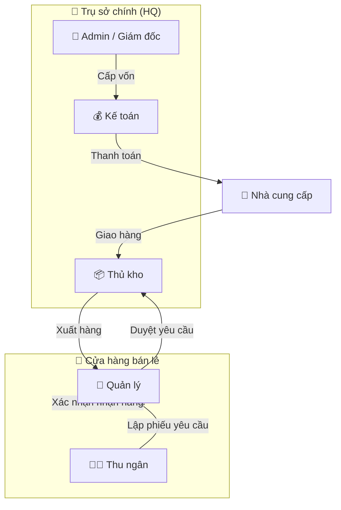
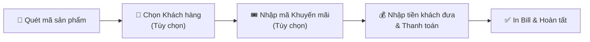
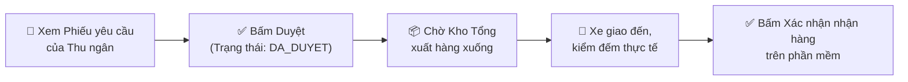

# Luồng Nghiệp Vụ Theo Vai Trò (Role-based Workflows) — CHÍNH THỨC

> **Dự án:** ERP Chuỗi Cửa Hàng Tiện Lợi  
> **Phiên bản:** FINAL (Cập nhật Luồng Yêu cầu hàng, Khách hàng & Khuyến mãi)  

---

## TỔNG QUAN BỘ MÁY VẬN HÀNH

---

## 1. THU NGÂN (Cashier)

### Luồng 1.1: Bán hàng (Nghiệp vụ cốt lõi)

**Khi bấm Hoàn tất:**
1. Tạo 1 dòng `hoa_don` (tính kèm tiền giảm giá).
2. Trừ tồn kho tại chi nhánh.
3. Ghi thẻ kho `BAN_HANG`.
4. Tạo sổ quỹ `THU`.

### Luồng 1.2: Yêu cầu nhập hàng
- Thu ngân thấy kệ hết hàng → Lập **Phiếu yêu cầu nhập hàng** trên hệ thống (chọn SP, SL) → Phiếu ở trạng thái `CHO_DUYET`.

---

## 2. QUẢN LÝ CHI NHÁNH (Store Manager)

### Luồng 2.1: Duyệt yêu cầu & Nhận hàng

**Khi bấm Xác nhận nhận hàng (Transaction):**
- Trừ tồn Kho Tổng, Cộng tồn Chi nhánh. Ghi 2 dòng thẻ kho. Trạng thái Phiếu xuất chuyển thành `DA_NHAN`.

---

## 3. THỦ KHO (Warehouse Manager)

### Luồng 3.1: Nhập hàng từ Nhà Cung Cấp
- Xe NCC giao hàng → Tạo Phiếu Nhập → Lưu.
- Kho Tổng tăng tồn, ghi nhận thẻ kho, tự động tạo dòng Sổ quỹ `CHI` để Kế toán thanh toán sau.

### Luồng 3.2: Xuất hàng theo Yêu cầu
- Thấy Phiếu yêu cầu ở trạng thái `DA_DUYET` → Tạo Phiếu Xuất Kho xuất hàng đi → Trạng thái chuyển thành `CHO_NHAN`.

---

## 4. KẾ TOÁN (Accountant)

### Luồng 4.1: Thanh toán cho Nhà Cung Cấp
- Xem Phiếu nhập hàng từ Thủ kho → Vào Sổ quỹ duyệt chi bằng nguồn vốn do Admin đã cấp ban đầu.

---

## 5. ADMIN / GIÁM ĐỐC (Director)

### Luồng 5.1: Cấp vốn ban đầu (Khởi tạo dòng tiền)
- Tạo 1 phiếu `SO_QUY` (Loại `THU`, Hạng mục `CAP_VON`) với số tiền lớn (VD: 1 Tỷ VND). Kế toán dùng tiền này để vận hành.

### Luồng 5.2: Quản lý Khách hàng & Khuyến mãi
- Tạo mã giảm giá (VD: `MUAXUAN10`) giảm 10% tối đa 50k trên tổng hóa đơn để Thu ngân áp dụng.
