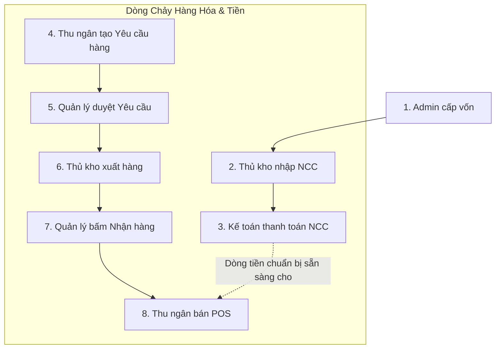

# Quy Trình Nghiệp Vụ ERP: Luồng Demo Cốt Lõi Khép Kín

> **Dự án:** ERP Chuỗi Cửa Hàng Tiện Lợi  
> **Phiên bản:** FINAL  

Tài liệu này trình bày **một nghiệp vụ xuyên suốt duy nhất** nhằm phục vụ cho mục đích trình diễn (Demo) toàn bộ hệ thống web. Mọi tính năng ERP đều hội tụ trong kịch bản này.

---

## Kịch Bản Demo: 8 Bước Vận Hành Chuỗi Cửa Hàng

### Bước 1: Khởi tạo dòng tiền (Admin)
Admin tạo một phiếu Thu trong Sổ quỹ, hạng mục "Cấp vốn" với số tiền 1 Tỷ VND. Khoản tiền này giúp Kế toán có ngân sách để vận hành công ty.

### Bước 2: Nhập hàng từ Nhà cung cấp (Thủ kho)
Thủ kho nhận hàng từ Nhà cung cấp, lập Phiếu Nhập vào Kho Tổng. Hệ thống lập tức cộng tồn Kho Tổng và tạo một khoản nợ/chi trong Sổ quỹ.

### Bước 3: Thanh toán tiền nhập hàng (Kế toán)
Kế toán đối chiếu phiếu nhập, sử dụng khoản ngân sách 1 Tỷ VND để duyệt chi trả tiền hóa đơn cho Nhà cung cấp. Tiền trong Sổ quỹ giảm xuống.

### Bước 4: Tạo yêu cầu cung cấp hàng (Thu ngân)
Nhân viên bán hàng (Thu ngân) tại cửa hàng phát hiện hàng sắp hết, lập "Phiếu yêu cầu nhập hàng" trên phần mềm gửi lên Quản lý chi nhánh.

### Bước 5: Duyệt yêu cầu (Quản lý chi nhánh)
Quản lý chi nhánh kiểm tra phiếu yêu cầu của Thu ngân, nếu hợp lý thì bấm "Duyệt". Lệnh này được đẩy thẳng lên màn hình của Thủ kho ở Trụ sở.

### Bước 6: Xuất hàng xuống chi nhánh (Thủ kho)
Dựa trên phiếu yêu cầu đã duyệt, Thủ kho tạo Phiếu xuất kho. Hàng được đưa lên xe tải vận chuyển xuống chi nhánh.

### Bước 7: Xác nhận nhận hàng (Quản lý chi nhánh)
Khi xe tới cửa hàng, Quản lý chi nhánh kiểm đếm thực tế. Nếu đủ hàng, Quản lý bấm "Xác nhận nhận hàng". Lập tức, hệ thống trừ tồn Kho Tổng và cộng tồn Chi nhánh. Thẻ kho được ghi vết ở cả hai bên.

### Bước 8: Bán hàng (Thu ngân)
Khách hàng vào cửa hàng. Thu ngân quét mã vạch sản phẩm, chọn tên Khách hàng để lưu lịch sử, nhập mã Khuyến mãi để giảm giá, và tiến hành thanh toán POS.
Hệ thống trừ tồn chi nhánh, tăng doanh thu trên Sổ quỹ, và cập nhật Dashboard để Admin theo dõi.

---

## Sơ đồ luồng nghiệp vụ Demo

