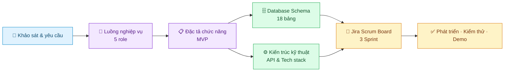

# 🏪 ERP Chuỗi Cửa Hàng Tiện Lợi

<p align="center">
  <strong>Quản lý hàng hóa · bán hàng · nhân sự · tài chính cho mô hình Kho Tổng → Chi nhánh</strong>
</p>

<p align="center">
  <a href="./dac_ta_chuc_nang_v1_0.md"></a>
  <a href="./luong_nghiep_vu.md"></a>
  <a href="./co_so_du_lieu.md"></a>
  <a href="./ke_hoach_jira.md"></a>
</p>

> Đây là **cổng điều hướng tài liệu chính thức** của dự án. Trước khi làm việc, mỗi thành viên hãy đi theo lối tắt phù hợp với vai trò của mình ở bên dưới.

---

## 🚀 Truy cập nhanh theo vai trò

| Bạn là ai? | Hãy mở theo thứ tự này | Mục đích |
|:--|:--|:--|
| 🧩 **BA** | [Đặc tả chức năng](./dac_ta_chuc_nang_v1_0.md) → [Luồng 5 role](./luong_nghiep_vu.md) → [Jira Scrum Board](./ke_hoach_jira.md) | Làm rõ yêu cầu, business rule, báo cáo và acceptance criteria |
| 💻 **Dev** | [Kiến trúc kỹ thuật](./kien_truc_ky_thuat.md) → [Database Schema](./co_so_du_lieu.md) → [Jira Scrum Board](./ke_hoach_jira.md) | Xây dựng đúng stack, API, transaction và thứ tự sprint |
| 🧪 **Tester** | [Luồng 5 role](./luong_nghiep_vu.md) → [Đặc tả chức năng](./dac_ta_chuc_nang_v1_0.md) → [Jira Scrum Board](./ke_hoach_jira.md) | Viết test case, kiểm tra phân quyền và nghiệm thu từng task |
| 🎨 **UI/UX tham khảo** | [Design System](./he_thong_thiet_ke_phase2.md) → [UX Architecture](./kien_truc_ux.md) → [Figma App Shell Brief](./tom_tat_giao_dien_figma.md) | Tái sử dụng visual foundation và layout pattern |

---

## 🗺️ Bản đồ tài liệu



---

## ⭐ Tài liệu chính thức — dùng để ra quyết định

| Tài liệu | Nội dung chính | Dành cho |
|:--|:--|:--|
| 🟣 [Đặc tả Chức năng MVP](./dac_ta_chuc_nang_v1_0.md) | 14 nhóm chức năng, phạm vi MVP, business rule, ma trận quyền | Cả team |
| 🔵 [Luồng Nghiệp vụ 5 Role](./luong_nghiep_vu.md) | Luồng thực tế của Admin, Kế toán, Thủ kho, Quản lý, Thu ngân | BA · Tester · Dev |
| 🟢 [Database Schema](./co_so_du_lieu.md) | ERD, 18 bảng, ràng buộc dữ liệu và phân quyền | Dev · Tester |
| 🟠 [Kiến trúc Kỹ thuật](./kien_truc_ky_thuat.md) | React/TypeScript, Express/Prisma/PostgreSQL, API và transaction | Dev |
| 🔴 [Jira Scrum Board](./ke_hoach_jira.md) | Task, deadline, phụ thuộc và tiêu chí nghiệm thu của 3 sprint | Cả team |

<p align="center">
  <a href="./dac_ta_chuc_nang_v1_0.md"></a>
  <a href="./luong_nghiep_vu.md"></a>
  <a href="./co_so_du_lieu.md"></a>
  <a href="./ke_hoach_jira.md"></a>
</p>

---

## 🎨 Tài liệu tham khảo giao diện

> Các file dưới đây giữ lại nền tảng thiết kế tốt từ phase trước. Khi có mâu thuẫn về **module, menu hoặc phân quyền**, luôn ưu tiên tài liệu chính thức ở phần trên.

| Tài liệu | Được dùng cho | Không dùng để quyết định |
|:--|:--|:--|
| 🟦 [Design System Phase 2](./he_thong_thiet_ke_phase2.md) | Màu sắc, typography, spacing, data table, POS pattern | Scope/chức năng nghiệp vụ |
| 🟪 [UX Architecture](./kien_truc_ux.md) | Pattern UX, trạng thái loading/error, bố cục POS | Role, sidebar, module cũ |
| 🟧 [Figma App Shell Brief](./tom_tat_giao_dien_figma.md) | Auto Layout, responsive layout, component shell | Navigation và permission cũ |

---

## 📦 Phạm vi MVP

<details>
<summary><strong>Nhấn để xem 14 nhóm chức năng đang triển khai</strong></summary>

<br />

`Đăng nhập & phân quyền` · `Dashboard` · `POS` · `Chi nhánh` · `Nhân viên` · `Danh mục & sản phẩm` · `Nhà cung cấp` · `Tồn kho & thẻ kho` · `Nhập kho NCC` · `Xuất kho nội bộ` · `Kiểm kê` · `Chấm công & bảng lương` · `Sổ quỹ` · `Báo cáo`

</details>

<details>
<summary><strong>Nhấn để xem các phần để phase sau</strong></summary>

<br />

`Tích hợp ngân hàng thật` · `Máy quét mã vạch thật` · `CRM khách hàng` · `Khuyến mãi` · `Công nợ NCC` · `Offline POS` · `Hủy/hoàn hóa đơn`

</details>

---

## ✅ Quy tắc làm việc chung

1. Không tự thay đổi phạm vi MVP khi chưa cập nhật **Đặc tả Chức năng** và Jira.
2. Nghiệp vụ làm thay đổi tồn kho hoặc tiền phải bám đúng transaction trong **Kiến trúc Kỹ thuật**.
3. Mọi task chỉ hoàn thành khi đạt acceptance criteria và được Tester xác nhận.
4. Không có ai được tự xác nhận hoặc duyệt lương cho chính mình.

---

## 🕒 Nhật ký cập nhật (Changelog)

- **[Khởi tạo dự án] Task ERP-S1-02 (Hoàn thành):**
  - **Cấu trúc Monorepo**: Tách biệt 2 module độc lập `frontend` và `backend`.
  - **Backend (Spring Boot 3 + Java 21)**: Cấu hình đọc trực tiếp file bảo mật `.env` (không bị đưa lên github). Tự động tạo 18 bảng CSDL qua JPA. Thiết kế một Banner siêu to thông báo trạng thái cổng 8080 cho team dễ nhìn. Đã triệt tiêu các cảnh báo (WARN) không đáng có trong log.
  - **Hỗ trợ DevOps**: Có sẵn `docker-compose.yml` (để chạy DB cục bộ nếu cần) và `mvnw` (cho máy tính nào chưa có Maven).
  - **Frontend (React Vite + TS)**: Lên sẵn khung sườn Redux Toolkit, React Router DOM, Ant Design và Axios.

---

## 💻 Hướng dẫn chạy dự án (Dành cho Dev/Tester)

Dự án được cấu trúc theo dạng Monorepo, chia thành hai phần: **Frontend** và **Backend**.

### 1. Khởi chạy Backend (Spring Boot)
Yêu cầu: Java 21, Maven.
```bash
cd backend
# Cấu hình file .env dựa trên .env.example (hoặc để mặc định localhost)
.\mvnw.cmd spring-boot:run
```
> Backend sẽ chạy ở địa chỉ: `http://localhost:8080`.
> Chạy lần đầu tiên, Hibernate sẽ tự động cập nhật Database và nạp dữ liệu mẫu (Seeder).

### 2. Khởi chạy Frontend (React Vite)
Yêu cầu: Node.js (v18+).
```bash
cd frontend
npm install
npm run dev
```
> Frontend sẽ chạy ở địa chỉ: `http://localhost:5173`.

### 3. Khắc phục cho thiết bị thiếu môi trường (Tài nguyên)
Nếu máy bạn chưa cài đặt Maven cục bộ hoặc PostgreSQL:
- **Thiếu PostgreSQL**: Trong thư mục `backend`, hãy chạy lệnh `docker-compose up -d` (Yêu cầu phải có Docker). Nó sẽ tự động dựng một Database PostgreSQL ảo ở cổng `5432` cho bạn.
- **Thiếu Maven**: Không dùng lệnh `mvn`, hãy thay thế bằng file thực thi mà tôi đã nhúng sẵn trong thư mục `backend`:
  - Trên Windows: `.\mvnw.cmd spring-boot:run`
  - Trên Mac/Linux: `./mvnw spring-boot:run`

---

<p align="center">
  <sub>ERP Chuỗi Cửa Hàng Tiện Lợi · Hub & Spoke · Kho Tổng → Cửa hàng bán lẻ</sub>
</p>
