# Sơ Đồ Cơ Sở Dữ Liệu (Database Schema) — CHÍNH THỨC

> **Dự án:** ERP Chuỗi Cửa Hàng Tiện Lợi  
> **Mô hình:** Hub & Spoke (Kho Tổng + Cửa hàng bán lẻ)  
> **Quy ước đặt tên:** Tiếng Việt không dấu, phân cách bằng dấu gạch dưới  
> **Tổng số bảng:** 18  
> **Phiên bản:** FINAL  

---

## MỤC LỤC

| # | Bảng | Thuộc Khối |
|:--|:---|:---|
| 1 | `chi_nhanh` | Trung tâm |
| 2 | `nhan_vien` | Nhân sự & Lương |
| 3 | `cham_cong` | Nhân sự & Lương |
| 4 | `bang_luong` | Nhân sự & Lương |
| 5 | `danh_muc` | Hàng hóa |
| 6 | `san_pham` | Hàng hóa |
| 7 | `ton_kho` | Kho hàng |
| 8 | `the_kho` | Kho hàng |
| 9 | `phieu_kiem_ke` | Kiểm kê |
| 10 | `chi_tiet_kiem_ke` | Kiểm kê |
| 11 | `hoa_don` | Bán hàng (POS) |
| 12 | `chi_tiet_hoa_don` | Bán hàng (POS) |
| 13 | `nha_cung_cap` | Mua hàng & Nhập kho |
| 14 | `phieu_nhap` | Mua hàng & Nhập kho |
| 15 | `chi_tiet_phieu_nhap` | Mua hàng & Nhập kho |
| 16 | `phieu_xuat_kho` | Luân chuyển nội bộ |
| 17 | `chi_tiet_phieu_xuat` | Luân chuyển nội bộ |
| 18 | `so_quy` | Tài chính |

---

## SƠ ĐỒ ERD

```mermaid
erDiagram
    %% ==========================================
    %% KHỐI 1: TRUNG TÂM
    %% ==========================================
    CHI_NHANH {
        uuid id PK
        string ten_chi_nhanh
        string dia_chi
        string loai "KHO_TONG | CUA_HANG_BAN_LE"
        boolean dang_hoat_dong
        datetime ngay_tao
    }

    %% ==========================================
    %% KHỐI 2: NHÂN SỰ & LƯƠNG
    %% ==========================================
    NHAN_VIEN {
        uuid id PK
        uuid id_chi_nhanh FK
        string ten_dang_nhap "Unique"
        string mat_khau
        string ho_ten
        string so_dien_thoai
        string vai_tro "ADMIN | KE_TOAN | THU_KHO | QUAN_LY | THU_NGAN"
        decimal luong_theo_gio
        string so_tai_khoan "STK ngan hang nhan luong"
        string ten_ngan_hang
        boolean dang_hoat_dong
        datetime ngay_tao
    }

    CHAM_CONG {
        uuid id PK
        uuid id_nhan_vien FK
        datetime gio_vao
        datetime gio_ra
        decimal tong_gio "Tu tinh khi Check-out"
        string ghi_chu
    }

    BANG_LUONG {
        uuid id PK
        uuid id_nhan_vien FK
        string thang_nam "VD 08-2026"
        decimal tong_gio_lam "Gio he thong tong hop"
        decimal gio_dieu_chinh "Gio sau khi QL dieu chinh"
        string ly_do_dieu_chinh
        decimal luong_theo_gio "Snapshot luong tai thoi diem chot"
        decimal tong_tien_luong
        string trang_thai "CHO_XAC_NHAN | DA_XAC_NHAN | DA_THANH_TOAN"
        uuid id_nguoi_xac_nhan FK "QL xac nhan gio - Tang 1"
        uuid id_nguoi_duyet_chi FK "Ke toan duyet chi - Tang 2"
        datetime ngay_tao
        datetime ngay_xac_nhan
        datetime ngay_thanh_toan
    }

    %% ==========================================
    %% KHỐI 3: HÀNG HÓA
    %% ==========================================
    DANH_MUC {
        uuid id PK
        string ten_danh_muc
        datetime ngay_tao
    }

    SAN_PHAM {
        uuid id PK
        uuid id_danh_muc FK
        string ma_vach "Unique"
        string ten_san_pham
        decimal gia_von "Gia von trung binh"
        decimal gia_ban "Gia ban le"
        boolean dang_hoat_dong
        datetime ngay_tao
    }

    %% ==========================================
    %% KHỐI 4: KHO HÀNG
    %% Dùng chung cho Kho Tổng và Cửa hàng.
    %% Phân biệt bằng id_chi_nhanh.
    %% ==========================================
    TON_KHO {
        uuid id_san_pham PK_FK
        uuid id_chi_nhanh PK_FK
        int so_luong_ton
    }

    THE_KHO {
        uuid id PK
        uuid id_san_pham FK
        uuid id_chi_nhanh FK
        string loai_giao_dich "NHAP_NCC | XUAT_CHI_NHANH | NHAN_TU_KHO | BAN_HANG | CAN_BANG_KIEM_KE | HAO_HUT"
        int so_luong "Duong = vao kho - Am = ra kho"
        string ma_chung_tu "VD HD-xxx PN-xxx PX-xxx KK-xxx"
        string ghi_chu
        datetime ngay_tao
    }

    %% ==========================================
    %% KHỐI 5: KIỂM KÊ KHO
    %% ==========================================
    PHIEU_KIEM_KE {
        uuid id PK
        uuid id_chi_nhanh FK "Kho Tong hoac Cua hang"
        uuid id_nguoi_tao FK "Thu kho hoac Quan ly CN"
        string trang_thai "DANG_KIEM_KE | DA_CAN_BANG"
        string ghi_chu
        datetime ngay_tao
    }

    CHI_TIET_KIEM_KE {
        uuid id PK
        uuid id_phieu_kiem_ke FK
        uuid id_san_pham FK
        int ton_he_thong "So luong may bao"
        int ton_thuc_te "So luong dem bang tay"
        int so_luong_lech "= ton_thuc_te - ton_he_thong"
        string ly_do_lech "VD Hu hong - Khach lay cap"
    }

    %% ==========================================
    %% KHỐI 6: BÁN HÀNG (POS)
    %% ==========================================
    HOA_DON {
        uuid id PK
        uuid id_chi_nhanh FK
        uuid id_thu_ngan FK
        decimal tong_tien
        string hinh_thuc_tt "TIEN_MAT | CHUYEN_KHOAN"
        decimal tien_khach_dua
        decimal tien_thoi
        datetime ngay_tao
    }

    CHI_TIET_HOA_DON {
        uuid id PK
        uuid id_hoa_don FK
        uuid id_san_pham FK
        int so_luong
        decimal don_gia "Snapshot gia ban tai thoi diem ban"
        decimal thanh_tien "= so_luong x don_gia"
    }

    %% ==========================================
    %% KHỐI 7: MUA HÀNG & NHẬP KHO
    %% ==========================================
    NHA_CUNG_CAP {
        uuid id PK
        string ten_ncc
        string so_dien_thoai
        string dia_chi
        datetime ngay_tao
    }

    PHIEU_NHAP {
        uuid id PK
        uuid id_chi_nhanh FK "Chi nhap vao Kho Tong"
        uuid id_ncc FK
        uuid id_nguoi_nhap FK "Thu kho"
        decimal tong_tien
        string ghi_chu
        datetime ngay_tao
    }

    CHI_TIET_PHIEU_NHAP {
        uuid id PK
        uuid id_phieu_nhap FK
        uuid id_san_pham FK
        int so_luong
        decimal don_gia_nhap
        decimal thanh_tien "= so_luong x don_gia_nhap"
    }

    %% ==========================================
    %% KHỐI 8: LUÂN CHUYỂN NỘI BỘ
    %% ==========================================
    PHIEU_XUAT_KHO {
        uuid id PK
        uuid id_chi_nhanh_xuat FK "Kho Tong"
        uuid id_chi_nhanh_nhan FK "Cua hang ban le"
        uuid id_nguoi_tao FK "Thu kho"
        string trang_thai "HOAN_THANH"
        string ghi_chu
        datetime ngay_tao
    }

    CHI_TIET_PHIEU_XUAT {
        uuid id PK
        uuid id_phieu_xuat FK
        uuid id_san_pham FK
        int so_luong
    }

    %% ==========================================
    %% KHỐI 9: TÀI CHÍNH & SỔ QUỸ
    %% ==========================================
    SO_QUY {
        uuid id PK
        uuid id_chi_nhanh FK "Noi phat sinh dong tien"
        string loai_phieu "THU | CHI"
        string hang_muc "BAN_HANG | TRA_LUONG | NHAP_HANG | CAP_VON | KHAC"
        decimal so_tien
        string ma_chung_tu "VD HD-xxx BL-xxx PN-xxx"
        string dien_giai "Mo ta ngan gon giao dich"
        uuid id_nguoi_tao FK
        datetime ngay_tao
    }

    %% ==========================================
    %% ĐƯỜNG LIÊN KẾT (RELATIONSHIPS)
    %% ==========================================

    %% --- Chi nhánh là trung tâm ---
    CHI_NHANH ||--o{ NHAN_VIEN : "noi lam viec"
    CHI_NHANH ||--o{ TON_KHO : "luu so luong ton"
    CHI_NHANH ||--o{ THE_KHO : "lich su kho"
    CHI_NHANH ||--o{ HOA_DON : "phat sinh doanh thu"
    CHI_NHANH ||--o{ PHIEU_NHAP : "nhan hang tu NCC"
    CHI_NHANH ||--o{ PHIEU_XUAT_KHO : "xuat di"
    CHI_NHANH ||--o{ PHIEU_XUAT_KHO : "nhan ve"
    CHI_NHANH ||--o{ PHIEU_KIEM_KE : "kiem ke dinh ky"
    CHI_NHANH ||--o{ SO_QUY : "quan ly quy tien"

    %% --- Nhân sự ---
    NHAN_VIEN ||--o{ CHAM_CONG : "cham cong"
    NHAN_VIEN ||--o{ BANG_LUONG : "nhan luong"
    NHAN_VIEN ||--o{ HOA_DON : "tao hoa don"
    NHAN_VIEN ||--o{ PHIEU_NHAP : "tao phieu nhap"
    NHAN_VIEN ||--o{ PHIEU_XUAT_KHO : "tao phieu xuat"
    NHAN_VIEN ||--o{ PHIEU_KIEM_KE : "tao phieu kiem ke"
    NHAN_VIEN ||--o{ SO_QUY : "tao phieu thu chi"

    %% --- Tài chính liên kết chứng từ ---
    BANG_LUONG ||--o| SO_QUY : "sinh phieu chi luong"
    HOA_DON ||--o| SO_QUY : "sinh phieu thu ban hang"
    PHIEU_NHAP ||--o| SO_QUY : "sinh phieu chi nhap hang"

    %% --- Hàng hóa ---
    DANH_MUC ||--o{ SAN_PHAM : "chua"
    SAN_PHAM ||--o{ TON_KHO : "nam tai kho"
    SAN_PHAM ||--o{ THE_KHO : "luu lich su"
    SAN_PHAM ||--o{ CHI_TIET_HOA_DON : "ban ra"
    SAN_PHAM ||--o{ CHI_TIET_PHIEU_NHAP : "nhap vao"
    SAN_PHAM ||--o{ CHI_TIET_PHIEU_XUAT : "xuat di"
    SAN_PHAM ||--o{ CHI_TIET_KIEM_KE : "kiem ke"

    %% --- Chứng từ cha - con ---
    NHA_CUNG_CAP ||--o{ PHIEU_NHAP : "cung cap"
    HOA_DON ||--|{ CHI_TIET_HOA_DON : "gom"
    PHIEU_NHAP ||--|{ CHI_TIET_PHIEU_NHAP : "gom"
    PHIEU_XUAT_KHO ||--|{ CHI_TIET_PHIEU_XUAT : "gom"
    PHIEU_KIEM_KE ||--|{ CHI_TIET_KIEM_KE : "gom"
```

---

## CHI TIẾT TỪNG BẢNG

### Khối 1: Trung tâm

#### Bảng 1 — `chi_nhanh`
> Lưu danh sách tất cả địa điểm trong chuỗi. Kho Tổng cũng là 1 chi nhánh (loại = `KHO_TONG`).

| Cột | Kiểu | Ràng buộc | Ghi chú |
|:---|:---|:---|:---|
| `id` | UUID | PK | |
| `ten_chi_nhanh` | VARCHAR(255) | NOT NULL | |
| `dia_chi` | VARCHAR(500) | | |
| `loai` | VARCHAR(20) | NOT NULL | `KHO_TONG` hoặc `CUA_HANG_BAN_LE` |
| `dang_hoat_dong` | BOOLEAN | DEFAULT true | Khóa chi nhánh thay vì xóa |
| `ngay_tao` | TIMESTAMP | DEFAULT NOW | |

---

### Khối 2: Nhân sự & Lương

#### Bảng 2 — `nhan_vien`
> Tài khoản đăng nhập, phân quyền, thông tin ngân hàng nhận lương.

| Cột | Kiểu | Ràng buộc | Ghi chú |
|:---|:---|:---|:---|
| `id` | UUID | PK | |
| `id_chi_nhanh` | UUID | FK → `chi_nhanh.id` | Nơi làm việc |
| `ten_dang_nhap` | VARCHAR(100) | UNIQUE, NOT NULL | |
| `mat_khau` | VARCHAR(255) | NOT NULL | Lưu dạng Hash |
| `ho_ten` | VARCHAR(255) | NOT NULL | |
| `so_dien_thoai` | VARCHAR(20) | | |
| `vai_tro` | VARCHAR(20) | NOT NULL | `ADMIN`, `KE_TOAN`, `THU_KHO`, `QUAN_LY`, `THU_NGAN` |
| `luong_theo_gio` | DECIMAL(12,0) | NOT NULL | Đơn vị VNĐ |
| `so_tai_khoan` | VARCHAR(30) | | STK ngân hàng nhận lương |
| `ten_ngan_hang` | VARCHAR(100) | | |
| `dang_hoat_dong` | BOOLEAN | DEFAULT true | |
| `ngay_tao` | TIMESTAMP | DEFAULT NOW | |

#### Bảng 3 — `cham_cong`
> Ghi nhận mỗi lần Check-in / Check-out của nhân viên.

| Cột | Kiểu | Ràng buộc | Ghi chú |
|:---|:---|:---|:---|
| `id` | UUID | PK | |
| `id_nhan_vien` | UUID | FK → `nhan_vien.id` | |
| `gio_vao` | TIMESTAMP | NOT NULL | Thời điểm Check-in |
| `gio_ra` | TIMESTAMP | | NULL nếu chưa Check-out |
| `tong_gio` | DECIMAL(5,2) | | Tự tính = `gio_ra` - `gio_vao` (đơn vị: giờ) |
| `ghi_chu` | TEXT | | |

#### Bảng 4 — `bang_luong`
> Bảng lương hàng tháng. Quy trình duyệt 2 tầng: Quản lý xác nhận giờ → Kế toán duyệt chi.

| Cột | Kiểu | Ràng buộc | Ghi chú |
|:---|:---|:---|:---|
| `id` | UUID | PK | |
| `id_nhan_vien` | UUID | FK → `nhan_vien.id` | |
| `thang_nam` | VARCHAR(7) | NOT NULL | Định dạng `MM-YYYY` (VD: `08-2026`) |
| `tong_gio_lam` | DECIMAL(7,2) | NOT NULL | Giờ hệ thống tự tổng hợp từ `cham_cong` |
| `gio_dieu_chinh` | DECIMAL(7,2) | | Giờ sau khi Quản lý điều chỉnh. NULL = không sửa |
| `ly_do_dieu_chinh` | TEXT | | Bắt buộc ghi nếu có điều chỉnh |
| `luong_theo_gio` | DECIMAL(12,0) | NOT NULL | Snapshot giá lương tại thời điểm chốt |
| `tong_tien_luong` | DECIMAL(15,0) | NOT NULL | = (`gio_dieu_chinh` hoặc `tong_gio_lam`) × `luong_theo_gio` |
| `trang_thai` | VARCHAR(20) | NOT NULL | `CHO_XAC_NHAN` → `DA_XAC_NHAN` → `DA_THANH_TOAN` |
| `id_nguoi_xac_nhan` | UUID | FK → `nhan_vien.id` | Quản lý CN (Tầng 1). NULL nếu chưa xác nhận |
| `id_nguoi_duyet_chi` | UUID | FK → `nhan_vien.id` | Kế toán (Tầng 2). NULL nếu chưa duyệt |
| `ngay_tao` | TIMESTAMP | DEFAULT NOW | |
| `ngay_xac_nhan` | TIMESTAMP | | |
| `ngay_thanh_toan` | TIMESTAMP | | |

---

### Khối 3: Hàng hóa

#### Bảng 5 — `danh_muc`
> Phân loại nhóm hàng (Nước uống, Bánh kẹo, Đồ gia dụng...).

| Cột | Kiểu | Ràng buộc | Ghi chú |
|:---|:---|:---|:---|
| `id` | UUID | PK | |
| `ten_danh_muc` | VARCHAR(255) | NOT NULL | |
| `ngay_tao` | TIMESTAMP | DEFAULT NOW | |

#### Bảng 6 — `san_pham`
> Thông tin sản phẩm dùng chung toàn hệ thống.

| Cột | Kiểu | Ràng buộc | Ghi chú |
|:---|:---|:---|:---|
| `id` | UUID | PK | |
| `id_danh_muc` | UUID | FK → `danh_muc.id` | |
| `ma_vach` | VARCHAR(50) | UNIQUE, NOT NULL | Barcode |
| `ten_san_pham` | VARCHAR(255) | NOT NULL | |
| `gia_von` | DECIMAL(12,0) | NOT NULL | Giá vốn trung bình (tính lại khi nhập hàng) |
| `gia_ban` | DECIMAL(12,0) | NOT NULL | Giá bán lẻ |
| `dang_hoat_dong` | BOOLEAN | DEFAULT true | |
| `ngay_tao` | TIMESTAMP | DEFAULT NOW | |

---

### Khối 4: Kho hàng

> **LƯU Ý QUAN TRỌNG:** Bảng `ton_kho` dùng chung cho cả Kho Tổng và Cửa hàng bán lẻ. Phân biệt bằng `id_chi_nhanh`. Khi `id_chi_nhanh` trỏ tới chi nhánh có `loai = KHO_TONG` thì đó là số hàng trong Kho Tổng.

#### Bảng 7 — `ton_kho`
> Số lượng tồn hiện tại của từng sản phẩm tại từng chi nhánh (bao gồm Kho Tổng).

| Cột | Kiểu | Ràng buộc | Ghi chú |
|:---|:---|:---|:---|
| `id_san_pham` | UUID | PK, FK → `san_pham.id` | Composite PK |
| `id_chi_nhanh` | UUID | PK, FK → `chi_nhanh.id` | Composite PK |
| `so_luong_ton` | INT | NOT NULL, DEFAULT 0 | |

#### Bảng 8 — `the_kho`
> Sổ cái kho. Ghi nhận MỌI biến động ra/vào kho. Đây là "hộp đen" không bao giờ xóa.

| Cột | Kiểu | Ràng buộc | Ghi chú |
|:---|:---|:---|:---|
| `id` | UUID | PK | |
| `id_san_pham` | UUID | FK → `san_pham.id` | |
| `id_chi_nhanh` | UUID | FK → `chi_nhanh.id` | |
| `loai_giao_dich` | VARCHAR(30) | NOT NULL | `NHAP_NCC`, `XUAT_CHI_NHANH`, `NHAN_TU_KHO`, `BAN_HANG`, `CAN_BANG_KIEM_KE`, `HAO_HUT` |
| `so_luong` | INT | NOT NULL | Dương (+) = vào kho. Âm (-) = ra kho |
| `ma_chung_tu` | VARCHAR(50) | | Tham chiếu ngược về chứng từ gốc |
| `ghi_chu` | TEXT | | |
| `ngay_tao` | TIMESTAMP | DEFAULT NOW | |

---

### Khối 5: Kiểm kê kho

#### Bảng 9 — `phieu_kiem_ke`
> Phiếu kiểm kê định kỳ (hàng tuần/tháng) tại Kho Tổng hoặc Cửa hàng.

| Cột | Kiểu | Ràng buộc | Ghi chú |
|:---|:---|:---|:---|
| `id` | UUID | PK | |
| `id_chi_nhanh` | UUID | FK → `chi_nhanh.id` | Kiểm kê ở đâu |
| `id_nguoi_tao` | UUID | FK → `nhan_vien.id` | Thủ kho hoặc Quản lý CN |
| `trang_thai` | VARCHAR(20) | NOT NULL | `DANG_KIEM_KE` → `DA_CAN_BANG` |
| `ghi_chu` | TEXT | | |
| `ngay_tao` | TIMESTAMP | DEFAULT NOW | |

#### Bảng 10 — `chi_tiet_kiem_ke`
> Từng dòng sản phẩm trong phiếu kiểm kê, ghi rõ lệch bao nhiêu, lý do gì.

| Cột | Kiểu | Ràng buộc | Ghi chú |
|:---|:---|:---|:---|
| `id` | UUID | PK | |
| `id_phieu_kiem_ke` | UUID | FK → `phieu_kiem_ke.id` | |
| `id_san_pham` | UUID | FK → `san_pham.id` | |
| `ton_he_thong` | INT | NOT NULL | Số lượng máy báo lúc bắt đầu đếm |
| `ton_thuc_te` | INT | NOT NULL | Số lượng đếm thực tế bằng tay |
| `so_luong_lech` | INT | NOT NULL | = `ton_thuc_te` - `ton_he_thong` |
| `ly_do_lech` | TEXT | | Bắt buộc ghi nếu `so_luong_lech` ≠ 0 |

---

### Khối 6: Bán hàng (POS)

#### Bảng 11 — `hoa_don`
> Hóa đơn bán hàng, ghi đầy đủ hình thức thanh toán và tiền thối.

| Cột | Kiểu | Ràng buộc | Ghi chú |
|:---|:---|:---|:---|
| `id` | UUID | PK | |
| `id_chi_nhanh` | UUID | FK → `chi_nhanh.id` | Chỉ cửa hàng bán lẻ |
| `id_thu_ngan` | UUID | FK → `nhan_vien.id` | Ai bán |
| `tong_tien` | DECIMAL(15,0) | NOT NULL | |
| `hinh_thuc_tt` | VARCHAR(20) | NOT NULL | `TIEN_MAT` hoặc `CHUYEN_KHOAN` |
| `tien_khach_dua` | DECIMAL(15,0) | | Bắt buộc nếu `TIEN_MAT` |
| `tien_thoi` | DECIMAL(15,0) | | = `tien_khach_dua` - `tong_tien` |
| `ngay_tao` | TIMESTAMP | DEFAULT NOW | |

#### Bảng 12 — `chi_tiet_hoa_don`
> Từng món hàng trong hóa đơn bán.

| Cột | Kiểu | Ràng buộc | Ghi chú |
|:---|:---|:---|:---|
| `id` | UUID | PK | |
| `id_hoa_don` | UUID | FK → `hoa_don.id` | |
| `id_san_pham` | UUID | FK → `san_pham.id` | |
| `so_luong` | INT | NOT NULL | |
| `don_gia` | DECIMAL(12,0) | NOT NULL | Snapshot giá bán tại thời điểm bán |
| `thanh_tien` | DECIMAL(15,0) | NOT NULL | = `so_luong` × `don_gia` |

---

### Khối 7: Mua hàng & Nhập kho

#### Bảng 13 — `nha_cung_cap`
> Danh sách nhà cung cấp.

| Cột | Kiểu | Ràng buộc | Ghi chú |
|:---|:---|:---|:---|
| `id` | UUID | PK | |
| `ten_ncc` | VARCHAR(255) | NOT NULL | |
| `so_dien_thoai` | VARCHAR(20) | | |
| `dia_chi` | VARCHAR(500) | | |
| `ngay_tao` | TIMESTAMP | DEFAULT NOW | |

#### Bảng 14 — `phieu_nhap`
> Phiếu nhập hàng từ NCC. Chỉ nhập vào Kho Tổng.

| Cột | Kiểu | Ràng buộc | Ghi chú |
|:---|:---|:---|:---|
| `id` | UUID | PK | |
| `id_chi_nhanh` | UUID | FK → `chi_nhanh.id` | Chỉ Kho Tổng |
| `id_ncc` | UUID | FK → `nha_cung_cap.id` | |
| `id_nguoi_nhap` | UUID | FK → `nhan_vien.id` | Thủ kho |
| `tong_tien` | DECIMAL(15,0) | NOT NULL | |
| `ghi_chu` | TEXT | | |
| `ngay_tao` | TIMESTAMP | DEFAULT NOW | |

#### Bảng 15 — `chi_tiet_phieu_nhap`
> Từng món hàng trong phiếu nhập.

| Cột | Kiểu | Ràng buộc | Ghi chú |
|:---|:---|:---|:---|
| `id` | UUID | PK | |
| `id_phieu_nhap` | UUID | FK → `phieu_nhap.id` | |
| `id_san_pham` | UUID | FK → `san_pham.id` | |
| `so_luong` | INT | NOT NULL | |
| `don_gia_nhap` | DECIMAL(12,0) | NOT NULL | |
| `thanh_tien` | DECIMAL(15,0) | NOT NULL | = `so_luong` × `don_gia_nhap` |

---

### Khối 8: Luân chuyển nội bộ

#### Bảng 16 — `phieu_xuat_kho`
> Phiếu xuất hàng từ Kho Tổng đến Cửa hàng bán lẻ.

| Cột | Kiểu | Ràng buộc | Ghi chú |
|:---|:---|:---|:---|
| `id` | UUID | PK | |
| `id_chi_nhanh_xuat` | UUID | FK → `chi_nhanh.id` | Kho Tổng |
| `id_chi_nhanh_nhan` | UUID | FK → `chi_nhanh.id` | Cửa hàng bán lẻ |
| `id_nguoi_tao` | UUID | FK → `nhan_vien.id` | Thủ kho |
| `trang_thai` | VARCHAR(20) | NOT NULL | `HOAN_THANH` |
| `ghi_chu` | TEXT | | |
| `ngay_tao` | TIMESTAMP | DEFAULT NOW | |

#### Bảng 17 — `chi_tiet_phieu_xuat`
> Từng món hàng trong phiếu xuất kho.

| Cột | Kiểu | Ràng buộc | Ghi chú |
|:---|:---|:---|:---|
| `id` | UUID | PK | |
| `id_phieu_xuat` | UUID | FK → `phieu_xuat_kho.id` | |
| `id_san_pham` | UUID | FK → `san_pham.id` | |
| `so_luong` | INT | NOT NULL | |

---

### Khối 9: Tài chính & Sổ quỹ

#### Bảng 18 — `so_quy`
> Sổ quỹ tiền mặt. Mọi dòng tiền Thu/Chi đều được ghi nhận ở đây.

| Cột | Kiểu | Ràng buộc | Ghi chú |
|:---|:---|:---|:---|
| `id` | UUID | PK | |
| `id_chi_nhanh` | UUID | FK → `chi_nhanh.id` | Nơi phát sinh / chịu chi phí |
| `loai_phieu` | VARCHAR(5) | NOT NULL | `THU` hoặc `CHI` |
| `hang_muc` | VARCHAR(20) | NOT NULL | `BAN_HANG`, `TRA_LUONG`, `NHAP_HANG`, `CAP_VON`, `KHAC` |
| `so_tien` | DECIMAL(15,0) | NOT NULL | |
| `ma_chung_tu` | VARCHAR(50) | | Tham chiếu: `HD-xxx`, `BL-xxx`, `PN-xxx` |
| `dien_giai` | TEXT | | Mô tả ngắn gọn giao dịch |
| `id_nguoi_tao` | UUID | FK → `nhan_vien.id` | Hệ thống tự tạo hoặc Kế toán |
| `ngay_tao` | TIMESTAMP | DEFAULT NOW | |

---

## QUY ƯỚC MÃ CHỨNG TỪ

| Tiền tố | Ý nghĩa | Ví dụ |
|:---|:---|:---|
| `HD-` | Hóa đơn bán hàng | `HD-a1b2c3d4` |
| `PN-` | Phiếu nhập hàng | `PN-e5f6g7h8` |
| `PX-` | Phiếu xuất kho nội bộ | `PX-i9j0k1l2` |
| `BL-` | Bảng lương | `BL-m3n4o5p6` |
| `KK-` | Phiếu kiểm kê | `KK-q7r8s9t0` |

---

## MA TRẬN PHÂN QUYỀN (5 ROLE)

| Chức năng | ADMIN | KE_TOAN | THU_KHO | QUAN_LY | THU_NGAN |
|:---|:---:|:---:|:---:|:---:|:---:|
| Quản lý Chi nhánh | ✅ | | | | |
| Quản lý tài khoản Nhân viên | ✅ | | | | |
| Quản lý Danh mục & Sản phẩm | ✅ | | | | |
| Nhập hàng từ NCC | ✅ | | ✅ | | |
| Xuất kho cho Chi nhánh | ✅ | | ✅ | | |
| Kiểm kê Kho Tổng | ✅ | | ✅ | | |
| Kiểm kê Cửa hàng | ✅ | | | ✅ | |
| Bán hàng (POS) | | | | ✅ | ✅ |
| Xem Hóa đơn (chi nhánh mình) | ✅ | ✅ | | ✅ | ✅ |
| Xác nhận giờ làm NV (Tầng 1) | ✅ | | | ✅ | |
| Duyệt chi lương (Tầng 2) | ✅ | ✅ | | | |
| Duyệt lương cho Kế toán | ✅ | | | | |
| Xem Sổ quỹ toàn hệ thống | ✅ | ✅ | | | |
| Xem Sổ quỹ chi nhánh mình | ✅ | ✅ | | ✅ | |
| Cấp vốn (Tạo Phiếu Thu Đầu tư) | ✅ | | | | |
| Xem Dashboard / Báo cáo | ✅ | ✅ | | | |
