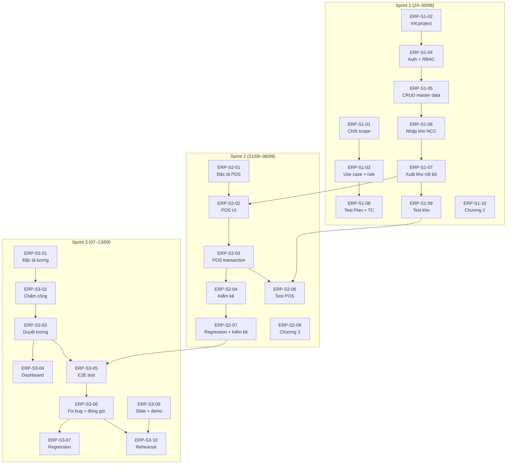

# Jira Scrum Board — ERP Cửa Hàng Tiện Lợi

> **Project Key:** `ERP`  
> **Tổng thời gian:** 3 Sprint × 7 ngày = 21 ngày (24/08 – 13/09/2026)  
> **Team:** 1 BA · 1 Dev · 1 Tester  
> **Nguồn chính thức:** [`co_so_du_lieu.md`](file:///d:/Documents/Nam4/WebApp-QuanLyCuaHangTienLoi/co_so_du_lieu.md) · [`luong_nghiep_vu.md`](file:///d:/Documents/Nam4/WebApp-QuanLyCuaHangTienLoi/luong_nghiep_vu.md) · [`dac_ta_chuc_nang_v1_0.md`](file:///d:/Documents/Nam4/WebApp-QuanLyCuaHangTienLoi/dac_ta_chuc_nang_v1_0.md)

---

## Quy Ước

| Ký hiệu | Ý nghĩa |
|:---:|:---|
| 📋 | To Do |
| 🔄 | In Progress |
| ✅ | Done |
| 🔴 | Blocker / Critical Path |
| ⚡ | Phụ thuộc task khác |

---

## SPRINT 1 — Nền Tảng & Kho Hàng

**Thời gian:** 24/08 – 30/08/2026 (7 ngày)  
**Sprint Goal:** Đăng nhập được, dữ liệu nền sẵn sàng, chạy được luồng nhập kho/xuất kho cơ bản.

### Mốc Nghiệm Thu Sprint 1
> Admin tạo dữ liệu master → Thủ kho nhập Coca vào Kho Tổng → Chuyển Coca sang Chi nhánh 1 → Tồn kho và thẻ kho khớp.

---

### ERP-S1-01: Chốt phạm vi MVP
**Type:** Task | **Assignee:** BA | **Priority:** 🔴 Highest  
**Deadline:** 25/08 | **Status:** 📋

| # | Công việc | Kết quả bàn giao |
|:--|:---|:---|
| 1 | Rà soát danh sách 14 module MVP, chốt P0/P1 | Scope document không thay đổi sau 25/08 |
| 2 | Xác nhận "Hủy hóa đơn = Không hỗ trợ trong MVP" | Ghi rõ trong BR-08 |
| 3 | Chốt môi trường: React Vite + Spring Boot + Neon PostgreSQL | Ghi rõ trong README |

---

### ERP-S1-02: Khởi tạo source code, database & dữ liệu mẫu
**Type:** Task | **Assignee:** Trần Văn Tiến (Tech Lead) | **Priority:** 🔴 Highest  
**Deadline:** 25/08 | **Status:** 📋

| # | Công việc | Kết quả bàn giao |
|:--|:---|:---|
| 1 | Init React/Vite + TypeScript + React Router + Redux Toolkit + Ant Design | FE chạy được `npm run dev` |
| 2 | Init Spring Boot 3 + Java 21 + Spring Data JPA | BE chạy được ứng dụng Spring Boot |
| 3 | Tạo JPA Entity cho 18 bảng theo [`co_so_du_lieu.md`](file:///d:/Documents/Nam4/WebApp-QuanLyCuaHangTienLoi/co_so_du_lieu.md) | Database tạo bảng thành công |
| 4 | Viết DataSeeder (Spring): 1 Kho Tổng + 2 Chi nhánh bán lẻ + tài khoản 5 role + 3 danh mục + 10 sản phẩm + 2 NCC | Khởi chạy app có dữ liệu tự động |
| 5 | Viết README hướng dẫn cài đặt & chạy | Thành viên mới clone về chạy được trong 5 phút |

---

### ERP-S1-03: Viết use case, business rule và quyền cho 5 role
**Type:** Task | **Assignee:** BA | **Priority:** High  
**Deadline:** 27/08 | **Status:** 📋  
**⚡ Phụ thuộc:** ERP-S1-01

| # | Công việc | Kết quả bàn giao |
|:--|:---|:---|
| 1 | Viết Use Case cho Sprint 1: Đăng nhập, CRUD master data, Nhập kho, Xuất kho | Use case diagram + mô tả |
| 2 | Viết Business Rules BR-01 → BR-08 chi tiết | Bảng rule kèm ví dụ cụ thể |
| 3 | Viết bảng phân quyền chi tiết 5 role × 17 chức năng | Bảng phân quyền FINAL làm chuẩn Dev/Test |

---

### ERP-S1-04: Đăng nhập, phân quyền 5 role & giới hạn dữ liệu theo chi nhánh
**Type:** Story | **Assignee:** Tô Minh Đức (BE), Lê Thu Trang (FE) | **Priority:** 🔴 Highest  
**Deadline:** 27/08 | **Status:** 📋  
**⚡ Phụ thuộc:** ERP-S1-02

| # | Công việc | Chi tiết |
|:--|:---|:---|
| 1 | API Login: nhận `ten_dang_nhap` + `mat_khau`, trả JWT | JWT chứa `id`, `vai_tro`, `id_chi_nhanh` |
| 2 | Middleware RBAC | Check `vai_tro` trên mỗi route, trả 403 nếu trái quyền |
| 3 | Middleware giới hạn chi nhánh | Query tự động filter theo `id_chi_nhanh` cho Quản lý/Thu ngân |
| 4 | FE: Trang Login + AuthGuard + Route protection | Redirect 403 cho URL trái quyền |
| 5 | FE: App Shell (Sidebar + Header) với menu ẩn/hiện theo role | Admin thấy tất cả, Thu ngân chỉ thấy POS + Chấm công |

**Acceptance Criteria:**
- Admin đăng nhập → thấy full sidebar
- Thu ngân đăng nhập → chỉ thấy POS, Chấm công
- Thu ngân gõ URL `/nhan-vien` → trang 403
- Quản lý CN1 → không thấy dữ liệu CN2

---

### ERP-S1-05: CRUD chi nhánh, nhân viên, danh mục, sản phẩm, nhà cung cấp
**Type:** Story | **Assignee:** Quang Anh, Trường (BE) & Nội, Đại (FE) | **Priority:** High  
**Deadline:** 29/08 | **Status:** 📋  
**⚡ Phụ thuộc:** ERP-S1-04

| # | Công việc | Chi tiết |
|:--|:---|:---|
| 1 | API + FE: CRUD `chi_nhanh` | Admin tạo/sửa/khóa chi nhánh |
| 2 | API + FE: CRUD `nhan_vien` | Admin tạo/sửa/khóa tài khoản, gán vai trò + chi nhánh |
| 3 | API + FE: CRUD `danh_muc` | Admin tạo/sửa/xóa danh mục (xóa nếu chưa có SP) |
| 4 | API + FE: CRUD `san_pham` | Admin tạo/sửa. Có giao dịch → chỉ tắt, không xóa |
| 5 | API + FE: CRUD `nha_cung_cap` | Admin tạo/sửa |

**Acceptance Criteria:**
- Admin tạo chi nhánh mới → hiện trong danh sách
- Admin tạo sản phẩm → mã vạch unique, giá vốn/giá bán > 0
- Admin khóa nhân viên → nhân viên đó không đăng nhập được

---

### ERP-S1-06: Nhập kho từ NCC (Phiếu nhập → Tồn kho → Thẻ kho → Sổ quỹ)
**Type:** Story | **Assignee:** Đặng Xuân Tuấn (BE), Trịnh Tuấn Đạt (FE) | **Priority:** 🔴 Critical Path  
**Deadline:** 29/08 | **Status:** 📋  
**⚡ Phụ thuộc:** ERP-S1-05 (cần có sản phẩm + NCC)

| # | Công việc | Chi tiết |
|:--|:---|:---|
| 1 | API: Tạo phiếu nhập + chi tiết | Chọn NCC, thêm SP + SL + đơn giá nhập |
| 2 | API: Transaction nhập kho | Cộng `ton_kho` Kho Tổng + Ghi `the_kho` NHAP_NCC + Tạo `so_quy` CHI |
| 3 | API: Tính lại giá vốn BQGQ | Formula: (Tồn cũ × Giá cũ + Nhập mới × Giá mới) / (Tồn cũ + Nhập mới) |
| 4 | FE: Trang tạo phiếu nhập | Form chọn NCC, thêm dòng sản phẩm, hiện tổng tiền |
| 5 | FE: Trang xem tồn kho + thẻ kho | Hiện tồn kho theo chi nhánh, lịch sử thẻ kho |

**Acceptance Criteria:**
- Thủ kho tạo phiếu nhập 100 lon Coca, giá 5.000đ → Tồn Kho Tổng tăng 100
- Thẻ kho ghi: NHAP_NCC, +100, mã chứng từ PN-xxx
- Sổ quỹ ghi: CHI, NHAP_HANG, 500.000đ

---

### ERP-S1-07: Xuất kho nội bộ (Kho Tổng → Chi nhánh)
**Type:** Story | **Assignee:** Đặng Xuân Tuấn (BE), Trịnh Tuấn Đạt (FE) | **Priority:** 🔴 Critical Path  
**Deadline:** 30/08 | **Status:** 📋  
**⚡ Phụ thuộc:** ERP-S1-06 (cần có tồn kho tại Kho Tổng)

| # | Công việc | Chi tiết |
|:--|:---|:---|
| 1 | API: Tạo phiếu xuất kho + chi tiết | Chọn CN đích, thêm SP + SL |
| 2 | API: Transaction xuất kho nguyên tử | Trừ tồn Kho Tổng + Cộng tồn CN nhận + 2 dòng thẻ kho |
| 3 | API: Validate không tồn âm | Nếu tồn Kho Tổng < SL xuất → reject 400 |
| 4 | FE: Trang tạo phiếu xuất kho | Chọn chi nhánh nhận, thêm SP + SL |

**Acceptance Criteria:**
- Xuất 50 lon Coca từ Kho Tổng → CN1: Kho Tổng giảm 50, CN1 tăng 50
- Thẻ kho Kho Tổng: XUAT_CHI_NHANH, -50
- Thẻ kho CN1: NHAN_TU_KHO, +50
- Xuất quá tồn → lỗi "Không đủ tồn kho"

---

### ERP-S1-08: Viết Test Plan + Test Case Sprint 1
**Type:** Task | **Assignee:** Tester | **Priority:** High  
**Deadline:** 27/08 | **Status:** 📋  
**⚡ Phụ thuộc:** ERP-S1-03 (cần use case + rule)

| # | Công việc | Kết quả bàn giao |
|:--|:---|:---|
| 1 | Viết Test Plan tổng thể | Phạm vi test, môi trường, tiêu chí pass/fail |
| 2 | Test Case đăng nhập | TC-001 → TC-00x: đúng/sai credentials, 5 role |
| 3 | Test Case phân quyền | Mỗi role truy cập từng chức năng: allow/deny |
| 4 | Test Case CRUD master data | Tạo/sửa/xóa/khóa cho 5 entity |

---

### ERP-S1-09: Test luồng nhập/xuất kho + regression auth
**Type:** Task | **Assignee:** Tester | **Priority:** High  
**Deadline:** 30/08 | **Status:** 📋  
**⚡ Phụ thuộc:** ERP-S1-06, ERP-S1-07

| # | Công việc | Kết quả bàn giao |
|:--|:---|:---|
| 1 | Test nhập kho: tồn tăng đúng, thẻ kho đúng, sổ quỹ đúng | Test report + screenshot |
| 2 | Test xuất kho: tồn giảm/tăng đúng, 2 dòng thẻ kho, reject tồn âm | Test report + screenshot |
| 3 | Test giá vốn BQGQ | Nhập 2 lần giá khác → giá vốn TB đúng công thức |
| 4 | Regression test đăng nhập + phân quyền + CRUD | Các test case Sprint 1 vẫn pass |
| 5 | Log bug lên Jira | Bug có ID, bước tái hiện, expected vs actual |

---

### ERP-S1-10: Hoàn thiện Chương 2 báo cáo đồ án
**Type:** Task | **Assignee:** BA | **Priority:** Medium  
**Deadline:** 30/08 | **Status:** 📋

| # | Công việc | Kết quả bàn giao |
|:--|:---|:---|
| 1 | Viết phân tích yêu cầu hệ thống | Yêu cầu chức năng + phi chức năng |
| 2 | Vẽ Use Case diagram | Diagram cho 5 actor × các use case chính |
| 3 | Vẽ Activity diagram cho luồng nhập/xuất kho | Diagram chi tiết |
| 4 | Vẽ Sequence diagram cho luồng đăng nhập | Diagram chi tiết |
| 5 | Viết nháp Chương 2 | Bản nháp word/markdown, để trống phần screenshot |

---

## SPRINT 2 — POS & Kiểm Kê

**Thời gian:** 31/08 – 06/09/2026 (7 ngày)  
**Sprint Goal:** Hoàn thành luồng bán hàng từ sản phẩm tại chi nhánh đến hóa đơn, tồn kho và doanh thu.

### Mốc Nghiệm Thu Sprint 2
> Thu ngân bán hàng tại chi nhánh → Tồn giảm đúng → Hóa đơn được tạo → Doanh thu xuất hiện trong sổ quỹ → Quản lý kiểm kê và cân bằng được tồn.

---

### ERP-S2-01: Đặc tả POS, hóa đơn, kiểm kê
**Type:** Task | **Assignee:** BA | **Priority:** High  
**Deadline:** 01/09 | **Status:** 📋

| # | Công việc | Kết quả bàn giao |
|:--|:---|:---|
| 1 | Đặc tả màn hình POS: layout 70/30, autofocus barcode, giỏ hàng, tính tiền | Wireframe + mô tả chi tiết |
| 2 | Đặc tả luồng thanh toán: tiền mặt vs chuyển khoản, tiền thối | Flowchart |
| 3 | Đặc tả kiểm kê: tạo phiếu, nhập tồn thực tế, cân bằng | Flowchart |
| 4 | Đặc tả ngoại lệ: tồn = 0 chặn bán, hủy hóa đơn = không hỗ trợ | Ghi rõ từng case |

---

### ERP-S2-02: POS — Tìm/quét mã, giỏ hàng, thanh toán, in hóa đơn
**Type:** Story | **Assignee:** Trang, Nội, Đại (FE) | **Priority:** 🔴 Critical Path  
**Deadline:** 03/09 | **Status:** 📋  
**⚡ Phụ thuộc:** ERP-S1-07 (cần có tồn kho tại chi nhánh)

| # | Công việc | Chi tiết |
|:--|:---|:---|
| 1 | FE: POS Layout riêng (không sidebar, full viewport) | Header: Logo + Thu ngân + Đồng hồ |
| 2 | FE: Ô tìm kiếm/quét mã vạch (autofocus, Enter thêm hàng) | Input nhận tín hiệu barcode scanner |
| 3 | FE: Giỏ hàng (thêm/xóa/sửa SL, tổng tiền realtime) | Cột phải 30%, scroll được |
| 4 | FE: Modal thanh toán (chọn tiền mặt/CK, nhập tiền khách, tính thối) | Tiền thối = tiền khách - tổng tiền |
| 5 | FE: In/xuất hóa đơn mô phỏng (window.print) | Bill hiện thông tin đơn hàng |

---

### ERP-S2-03: Khi bán — Trừ tồn, ghi thẻ kho, tạo sổ quỹ (Transaction)
**Type:** Story | **Assignee:** Đức, Quang Anh (BE), Tiến (Lead hỗ trợ) | **Priority:** 🔴 Critical Path  
**Deadline:** 04/09 | **Status:** 📋  
**⚡ Phụ thuộc:** ERP-S2-02

| # | Công việc | Chi tiết |
|:--|:---|:---|
| 1 | API: Tạo hóa đơn + chi tiết trong 1 transaction | `hoa_don` + `chi_tiet_hoa_don` |
| 2 | API: Trừ `ton_kho` tại chi nhánh | Check tồn ≥ SL bán, reject nếu không đủ |
| 3 | API: Ghi `the_kho` BAN_HANG (âm) cho mỗi SP | Mã chứng từ: HD-xxx |
| 4 | API: Tạo `so_quy` THU, BAN_HANG | Số tiền = tổng hóa đơn |
| 5 | API: Snapshot `don_gia` = `gia_ban` tại thời điểm bán | Tránh sai giá khi admin đổi giá sau |

**Acceptance Criteria:**
- Thu ngân bán 5 lon Coca tại CN1 → Tồn CN1 giảm 5
- Hóa đơn HD-xxx được tạo, tổng tiền đúng
- Thẻ kho: BAN_HANG, -5, HD-xxx
- Sổ quỹ: THU, BAN_HANG, 50.000đ tại CN1
- Bán khi tồn = 0 → lỗi "Không đủ tồn kho"

---

### ERP-S2-04: Kiểm kê và cân bằng kho
**Type:** Story | **Assignee:** Trường, Tuấn (BE) & Đạt (FE) | **Priority:** High  
**Deadline:** 06/09 | **Status:** 📋  
**⚡ Phụ thuộc:** ERP-S2-03

| # | Công việc | Chi tiết |
|:--|:---|:---|
| 1 | API: Tạo phiếu kiểm kê (DANG_KIEM_KE) | Gắn `id_chi_nhanh`, `id_nguoi_tao` |
| 2 | API: Thêm chi tiết kiểm kê | Mỗi SP: tồn hệ thống (tự lấy), tồn thực tế (nhập tay), lệch, lý do |
| 3 | API: Cân bằng kho (Transaction) | Cập nhật `ton_kho` + Ghi `the_kho` CAN_BANG_KIEM_KE + Chuyển DA_CAN_BANG |
| 4 | FE: Trang tạo/xem phiếu kiểm kê | Form nhập tồn thực tế, hiện chênh lệch, nút cân bằng |
| 5 | FE: Lịch sử phiếu kiểm kê | Danh sách phiếu đã tạo, trạng thái |

**Acceptance Criteria:**
- Quản lý CN1 tạo phiếu kiểm kê → hệ thống tự điền tồn hệ thống
- Nhập tồn thực tế 28 (hệ thống 30) → lệch -2, ghi lý do "Hư hỏng"
- Bấm cân bằng → tồn kho CN1 = 28, thẻ kho ghi CAN_BANG_KIEM_KE -2
- Thủ kho kiểm kê Kho Tổng, Quản lý kiểm kê cửa hàng (đúng role)

---

### ERP-S2-05: Ghi rõ "Hủy hóa đơn không hỗ trợ trong MVP"
**Type:** Task | **Assignee:** Trường (BA), Đại (FE) | **Priority:** Medium  
**Deadline:** 06/09 | **Status:** 📋

| # | Công việc | Kết quả bàn giao |
|:--|:---|:---|
| 1 | BA: Ghi BR-08 vào spec + kịch bản demo | Nếu hỏi bảo vệ, có câu trả lời chuẩn |
| 2 | Dev: Không có nút "Hủy" trên hóa đơn | UI rõ ràng, không tạo luồng dở dang |

---

### ERP-S2-06: Test POS
**Type:** Task | **Assignee:** Tester | **Priority:** 🔴 Critical Path  
**Deadline:** 04/09 | **Status:** 📋  
**⚡ Phụ thuộc:** ERP-S2-03

| # | Công việc | Kết quả bàn giao |
|:--|:---|:---|
| 1 | Test quét mã/tìm kiếm thêm hàng vào giỏ | Đúng SP, đúng giá, cộng dồn SL |
| 2 | Test thanh toán tiền mặt: tiền thối đúng | Nhiều kịch bản tiền khách đưa |
| 3 | Test thanh toán chuyển khoản | Không cần nhập tiền khách |
| 4 | Test tồn kho = 0 → chặn bán | Báo lỗi rõ ràng |
| 5 | Test phân quyền POS | Chỉ Quản lý + Thu ngân dùng được POS |
| 6 | Test tồn kho giảm đúng, thẻ kho đúng, sổ quỹ đúng | Cross-check 3 bảng |

---

### ERP-S2-07: Regression Sprint 1 + Test kiểm kê
**Type:** Task | **Assignee:** Tester | **Priority:** High  
**Deadline:** 06/09 | **Status:** 📋  
**⚡ Phụ thuộc:** ERP-S2-04

| # | Công việc | Kết quả bàn giao |
|:--|:---|:---|
| 1 | Regression: Đăng nhập, phân quyền, CRUD, nhập/xuất kho | Tất cả test Sprint 1 vẫn pass |
| 2 | Test kiểm kê: tạo phiếu, cân bằng, thẻ kho | Bug report đầy đủ |
| 3 | Tổng hợp báo cáo chất lượng Sprint 2 | Số TC pass/fail/blocked |

---

### ERP-S2-08: Hoàn thiện Chương 3 báo cáo đồ án
**Type:** Task | **Assignee:** BA | **Priority:** Medium  
**Deadline:** 05/09 | **Status:** 📋

| # | Công việc | Kết quả bàn giao |
|:--|:---|:---|
| 1 | Thiết kế hệ thống: ERD chính thức | Copy từ `database_schema.md` |
| 2 | Kiến trúc: Tech stack, sơ đồ triển khai | Copy từ `technical_architecture.md` |
| 3 | Thiết kế giao diện: screenshot từ hệ thống thực | Chụp sau khi Dev deploy Sprint 2 |
| 4 | Viết Chương 3 | Bản nháp hoàn chỉnh |

---

## SPRINT 3 — Lương, Tài Chính, Báo Cáo & Bảo Vệ

**Thời gian:** 07/09 – 13/09/2026 (7 ngày)  
**Sprint Goal:** Hoàn thiện luồng quản trị còn lại, đóng lỗi và hoàn thành đồ án.

### Mốc Nghiệm Thu Sprint 3
> Thu ngân check-in/check-out → Quản lý xác nhận giờ → Kế toán duyệt chi lương → Sổ quỹ ghi CHI → Dashboard hiện số liệu nhất quán → Demo bảo vệ chạy mượt.

---

### ERP-S3-01: Đặc tả chấm công, bảng lương, duyệt 2 tầng
**Type:** Task | **Assignee:** BA | **Priority:** High  
**Deadline:** 08/09 | **Status:** 📋

| # | Công việc | Kết quả bàn giao |
|:--|:---|:---|
| 1 | Đặc tả Check-in/Check-out | Quy tắc: 1 ca/ngày, check-out mới tính giờ |
| 2 | Đặc tả bảng lương + duyệt 2 tầng | Bảng "Ai duyệt cho ai" rõ ràng |
| 3 | Đặc tả rule "Không tự duyệt lương" | Ví dụ cụ thể: Kế toán không duyệt được lương mình |

---

### ERP-S3-02: Check-in/out, tổng hợp giờ, bảng lương, điều chỉnh
**Type:** Story | **Assignee:** Tô Minh Đức (BE), Lê Thu Trang (FE) | **Priority:** 🔴 Critical Path  
**Deadline:** 09/09 | **Status:** 📋

| # | Công việc | Chi tiết |
|:--|:---|:---|
| 1 | API: Check-in (tạo `cham_cong` với `gio_vao`) | Mọi NV sau đăng nhập |
| 2 | API: Check-out (cập nhật `gio_ra`, tính `tong_gio`) | `tong_gio` = `gio_ra` - `gio_vao` (giờ) |
| 3 | API: Tổng hợp bảng lương tháng | Tạo `bang_luong` cho mỗi NV, `tong_gio_lam` = sum(`cham_cong.tong_gio`) |
| 4 | API: Quản lý điều chỉnh giờ + lý do | Sửa `gio_dieu_chinh`, bắt buộc `ly_do_dieu_chinh` |
| 5 | FE: Trang chấm công (nút check-in/out) | Hiện trạng thái ca hiện tại |
| 6 | FE: Trang bảng lương (Quản lý xem NV chi nhánh mình) | Bảng lương kèm nút điều chỉnh + xác nhận |

**Acceptance Criteria:**
- Thu ngân bấm Check-in 8:00 → Check-out 16:00 → tong_gio = 8.00
- Quản lý CN1 xem bảng lương → chỉ thấy NV CN1
- Quản lý điều chỉnh giờ 8 → 7.5, ghi lý do "Đi trễ 30 phút"

---

### ERP-S3-03: Duyệt lương 2 tầng + Sổ quỹ chi lương
**Type:** Story | **Assignee:** Nguyễn Hà Quang Anh (BE), La Xuân Nội (FE) | **Priority:** 🔴 Critical Path  
**Deadline:** 10/09 | **Status:** 📋  
**⚡ Phụ thuộc:** ERP-S3-02

| # | Công việc | Chi tiết |
|:--|:---|:---|
| 1 | API: Quản lý xác nhận giờ (Tầng 1) | Chuyển `CHO_XAC_NHAN` → `DA_XAC_NHAN`, ghi `id_nguoi_xac_nhan` |
| 2 | API: Kế toán duyệt chi (Tầng 2) | Chuyển `DA_XAC_NHAN` → `DA_THANH_TOAN`, ghi `id_nguoi_duyet_chi` |
| 3 | API: Tạo `so_quy` CHI, TRA_LUONG khi duyệt | Transaction: chuyển trạng thái + tạo sổ quỹ |
| 4 | API: Admin duyệt lương cho Kế toán | Case đặc biệt: bỏ qua Tầng 1 |
| 5 | API: Validate "không tự duyệt" | `id_nguoi_duyet_chi` ≠ `id_nhan_vien` |
| 6 | FE: Trang duyệt lương (Kế toán/Admin) | Danh sách bảng lương chờ duyệt, nút duyệt chi |

**Acceptance Criteria:**
- Quản lý xác nhận giờ Thu ngân A → trạng thái DA_XAC_NHAN
- Kế toán duyệt chi → trạng thái DA_THANH_TOAN + sổ quỹ CHI, TRA_LUONG
- Kế toán bấm duyệt lương chính mình → lỗi "Không thể tự duyệt"
- Admin duyệt được lương Kế toán

---

### ERP-S3-04: Dashboard tối thiểu
**Type:** Story | **Assignee:** Trường, Tuấn (BE) & Đại, Đạt (FE) | **Priority:** High  
**Deadline:** 10/09 | **Status:** 📋

| # | Công việc | Chi tiết |
|:--|:---|:---|
| 1 | API: Tổng doanh thu (sum `so_quy` THU, BAN_HANG) theo chi nhánh | Có filter theo tháng |
| 2 | API: Tổng chi nhập hàng (sum `so_quy` CHI, NHAP_HANG) | Theo tháng |
| 3 | API: Tổng chi lương (sum `so_quy` CHI, TRA_LUONG) | Theo tháng |
| 4 | API: Tồn kho theo chi nhánh (sum `ton_kho`) | Tổng số mặt hàng + tổng SL |
| 5 | FE: Trang Dashboard | 4 KPI cards + bảng tồn kho |

**Acceptance Criteria:**
- Dashboard hiện doanh thu = tổng hóa đơn đã tạo
- Dashboard hiện chi nhập = tổng phiếu nhập đã tạo
- Dashboard hiện chi lương = tổng bảng lương đã duyệt
- Số liệu nhất quán với sổ quỹ

---

### ERP-S3-05: End-to-end test 5 role + phân quyền
**Type:** Task | **Assignee:** Tester | **Priority:** 🔴 Critical Path  
**Deadline:** 10/09 | **Status:** 📋

| # | Công việc | Kết quả bàn giao |
|:--|:---|:---|
| 1 | Test luồng Admin: tạo dữ liệu, cấp vốn, xem dashboard | Screenshot từng bước |
| 2 | Test luồng Thủ kho: nhập NCC, xuất CN, kiểm kê Kho Tổng | Screenshot |
| 3 | Test luồng Quản lý: xem tồn CN, kiểm kê CN, xác nhận giờ, bán hàng | Screenshot |
| 4 | Test luồng Thu ngân: check-in, bán hàng, check-out | Screenshot |
| 5 | Test luồng Kế toán: xem sổ quỹ, duyệt chi lương, xem dashboard | Screenshot |
| 6 | Test phân quyền cross-role | Mỗi role truy cập 17 chức năng → bảng allow/deny |

---

### ERP-S3-06: Sửa bug P0/P1, seed dữ liệu demo, đóng gói
**Type:** Task | **Assignee:** Tiến (Lead) & Toàn bộ Dev | **Priority:** 🔴 Highest  
**Deadline:** 12/09 | **Status:** 📋

| # | Công việc | Kết quả bàn giao |
|:--|:---|:---|
| 1 | Fix tất cả bug P0 (blocker) từ TEST-05 | 0 bug P0 open |
| 2 | Fix bug P1 (major) nếu kịp | Ưu tiên bug ảnh hưởng demo |
| 3 | Viết seed data demo đầy đủ kịch bản bảo vệ | Có hóa đơn, phiếu nhập, phiếu xuất, bảng lương, sổ quỹ |
| 4 | Viết README hướng dẫn chạy bản release | Clone → install → migrate → seed → run trong 5 phút |

---

### ERP-S3-07: Regression toàn hệ thống
**Type:** Task | **Assignee:** Tester | **Priority:** High  
**Deadline:** 12/09 | **Status:** 📋

| # | Công việc | Kết quả bàn giao |
|:--|:---|:---|
| 1 | Chạy lại toàn bộ test case Sprint 1, 2, 3 | Bảng kết quả pass/fail |
| 2 | Xác nhận 0 bug blocker còn open | Sign-off release |
| 3 | Tổng hợp báo cáo chất lượng toàn dự án | Số TC, pass rate, bug metrics |

---

### ERP-S3-08: Hoàn thiện Chương 4/5 báo cáo đồ án
**Type:** Task | **Assignee:** BA | **Priority:** High  
**Deadline:** 11/09 | **Status:** 📋

| # | Công việc | Kết quả bàn giao |
|:--|:---|:---|
| 1 | Chương 4: Triển khai hệ thống | Hướng dẫn cài đặt, deploy, screenshot |
| 2 | Chương 4: Kết quả kiểm thử | Copy từ test report của Tester |
| 3 | Chương 5: Đánh giá kết quả | Đạt/chưa đạt so với yêu cầu |
| 4 | Chương 5: Hướng phát triển | Phase 2: Khách hàng, Khuyến mãi, Offline POS... |
| 5 | Hoàn thiện báo cáo toàn bộ | File hoàn chỉnh sẵn sàng in |

---

### ERP-S3-09: Soạn kịch bản demo & slide bảo vệ
**Type:** Task | **Assignee:** BA | **Priority:** 🔴 Highest  
**Deadline:** 12/09 | **Status:** 📋

| # | Công việc | Kết quả bàn giao |
|:--|:---|:---|
| 1 | Viết kịch bản demo 8–12 phút | Phân vai: ai đăng nhập role nào, thao tác gì |
| 2 | Chuẩn bị dữ liệu mẫu cho demo | Coca, Pepsi, NCC ABC, CN Quận 1, CN Quận 3 |
| 3 | Soạn slide bảo vệ | Tổng quan → Phân tích → Thiết kế → Demo → Kết luận |
| 4 | Rehearsal script | Dự trù câu hỏi + câu trả lời |

---

### ERP-S3-10: Chạy thử demo (Rehearsal)
**Type:** Task | **Assignee:** Cả team | **Priority:** 🔴 Highest  
**Deadline:** 13/09 | **Status:** 📋  
**⚡ Phụ thuộc:** ERP-S3-06, ERP-S3-09

| # | Công việc | Kết quả bàn giao |
|:--|:---|:---|
| 1 | Chạy demo đúng kịch bản, phân vai như bảo vệ thật | Video/ảnh chụp buổi rehearsal |
| 2 | Ghi lại lỗi thao tác, lỗi kịch bản, lỗi dữ liệu | Danh sách fix cuối cùng |
| 3 | Dev hotfix nếu phát hiện bug | Bản release cuối cùng |
| 4 | Team confirm "GO" cho buổi bảo vệ | Sign-off từ cả team |

---

## Tổng Hợp Task Theo Vai Trò

### BA (10 task)

| Sprint | Task | Deadline |
|:---:|:---|:---:|
| 1 | ERP-S1-01: Chốt scope MVP | 25/08 |
| 1 | ERP-S1-03: Use case + rule + quyền | 27/08 |
| 1 | ERP-S1-10: Chương 2 báo cáo | 30/08 |
| 2 | ERP-S2-01: Đặc tả POS + kiểm kê | 01/09 |
| 2 | ERP-S2-05: Ghi rõ hủy hóa đơn (cùng Dev) | 06/09 |
| 2 | ERP-S2-08: Chương 3 báo cáo | 05/09 |
| 3 | ERP-S3-01: Đặc tả lương + duyệt | 08/09 |
| 3 | ERP-S3-08: Chương 4/5 báo cáo | 11/09 |
| 3 | ERP-S3-09: Kịch bản demo + slide | 12/09 |
| 3 | ERP-S3-10: Rehearsal (cả team) | 13/09 |

### Đội Dev (9 thành viên: 1 Lead, 4 BE, 4 FE)

| Sprint | Task | Assignee (BE / FE) | Deadline |
|:---:|:---|:---|:---:|
| 1 | ERP-S1-02: Init project + DB + seed | **Tiến** (Tech Lead) | 25/08 |
| 1 | ERP-S1-04: Auth + RBAC + chi nhánh | **Đức** (BE) / **Trang** (FE) | 27/08 |
| 1 | ERP-S1-05: CRUD 5 entity master data | **QA, Trường** (BE) / **Nội, Đại** (FE) | 29/08 |
| 1 | ERP-S1-06: Nhập kho NCC (transaction) | **Tuấn** (BE) / **Đạt** (FE) | 29/08 |
| 1 | ERP-S1-07: Xuất kho nội bộ (transaction) | **Tuấn** (BE) / **Đạt** (FE) | 30/08 |
| 2 | ERP-S2-02: POS UI | **Trang, Nội, Đại** (FE) | 03/09 |
| 2 | ERP-S2-03: POS transaction (trừ tồn, sổ quỹ) | **Đức, QA** (BE) & **Tiến** (Lead) | 04/09 |
| 2 | ERP-S2-04: Kiểm kê + cân bằng kho | **Trường, Tuấn** (BE) / **Đạt** (FE) | 06/09 |
| 2 | ERP-S2-05: Ẩn nút hủy hóa đơn | **Đại** (FE) / *Trường (BA)* | 06/09 |
| 3 | ERP-S3-02: Chấm công + bảng lương | **Đức** (BE) / **Trang** (FE) | 09/09 |
| 3 | ERP-S3-03: Duyệt lương 2 tầng | **QA** (BE) / **Nội** (FE) | 10/09 |
| 3 | ERP-S3-04: Dashboard | **Trường, Tuấn** (BE) / **Đại, Đạt** (FE)| 10/09 |
| 3 | ERP-S3-06: Fix bug + seed demo + đóng gói| **Tiến** (Lead) & Toàn bộ Dev | 12/09 |

### Tester (6 task)

| Sprint | Task | Deadline |
|:---:|:---|:---:|
| 1 | ERP-S1-08: Test Plan + TC đăng nhập/quyền/CRUD | 27/08 |
| 1 | ERP-S1-09: Test nhập/xuất kho + regression | 30/08 |
| 2 | ERP-S2-06: Test POS | 04/09 |
| 2 | ERP-S2-07: Regression S1 + test kiểm kê | 06/09 |
| 3 | ERP-S3-05: E2E test 5 role | 10/09 |
| 3 | ERP-S3-07: Regression toàn hệ thống + sign-off | 12/09 |

---

## Dependency Map

