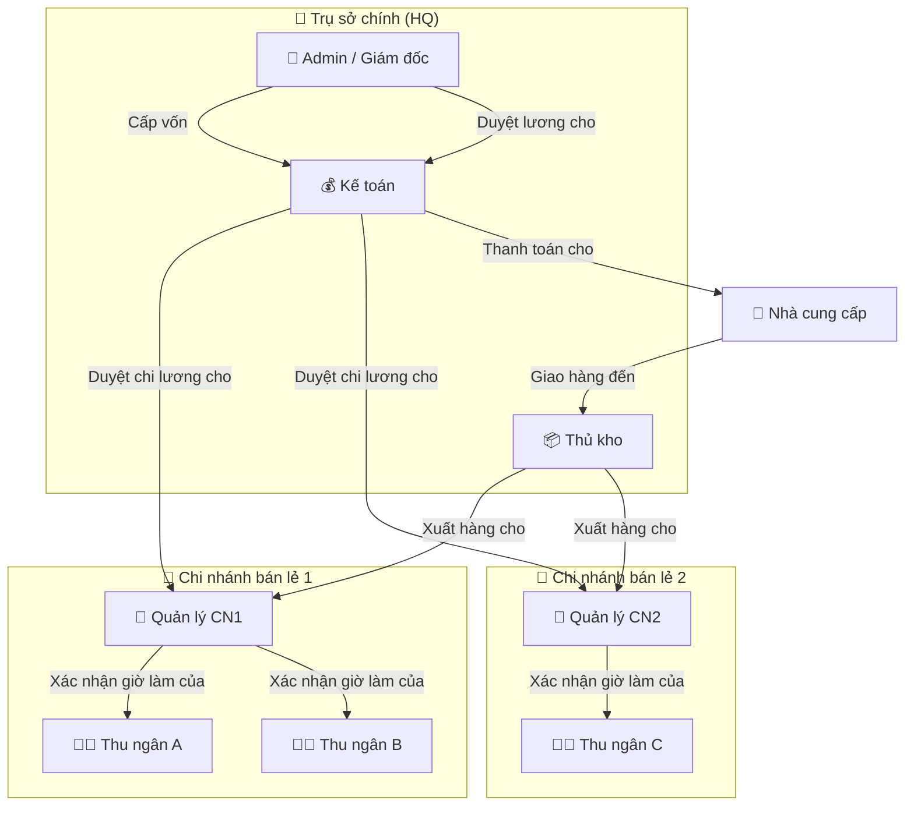
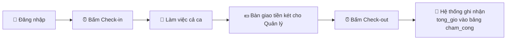
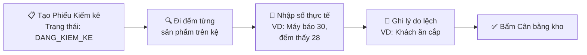
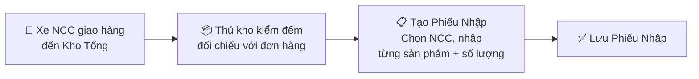
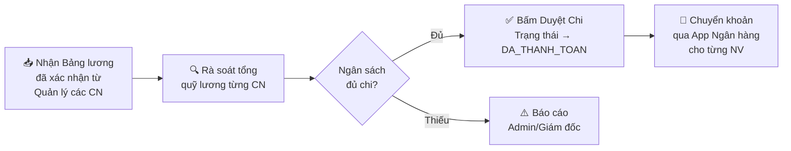
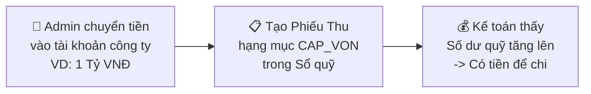
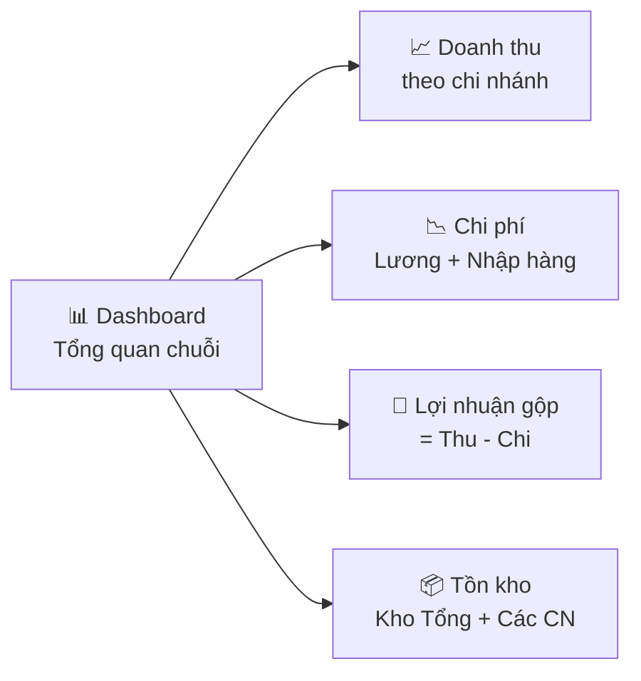
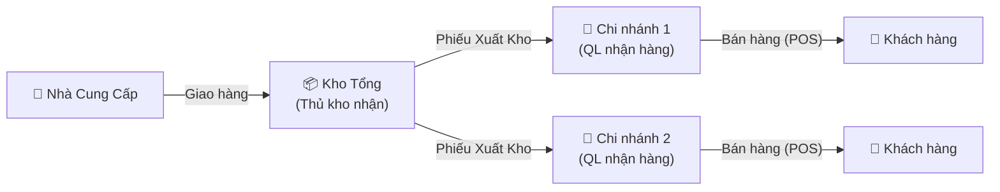
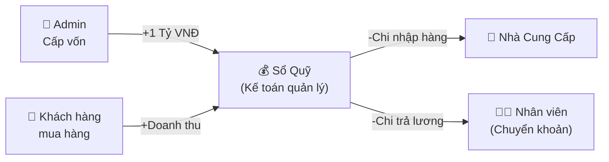

# Luồng Nghiệp Vụ Theo Vai Trò (Role-based Workflows) — CHÍNH THỨC

> **Dự án:** ERP Chuỗi Cửa Hàng Tiện Lợi  
> **Mô hình:** Hub & Spoke (Kho Tổng + Cửa hàng bán lẻ)  
> **Phương thức trả lương:** Chuyển khoản trực tiếp (Cách A)  
> **Tổng số vai trò:** 5 (Admin, Kế toán, Thủ kho, Quản lý, Thu ngân)  
> **Phiên bản:** FINAL  

---

## TỔNG QUAN BỘ MÁY VẬN HÀNH

**Nguyên tắc vàng:** Không ai tự duyệt lương cho chính mình.

---

## 1. THU NGÂN (Cashier)

> **Mục tiêu:** Tập trung 100% vào việc bán hàng. Không cần quan tâm đến kho, lương hay tài chính.  
> **Nơi làm việc:** Cửa hàng bán lẻ  
> **Màn hình chính:** POS (Bán hàng)

### Luồng 1.1: Bắt đầu / Kết thúc ca làm việc

### Luồng 1.2: Bán hàng (Nghiệp vụ cốt lõi)

**Khi bấm Hoàn tất, hệ thống thực hiện đồng thời:**
1. Tạo 1 dòng `hoa_don` + nhiều dòng `chi_tiet_hoa_don`.
2. Trừ `so_luong_ton` trong bảng `ton_kho` của chi nhánh.
3. Ghi 1 dòng `the_kho` (loại `BAN_HANG`, số lượng âm) cho mỗi sản phẩm.
4. Tạo 1 dòng `so_quy` (loại `THU`, hạng mục `BAN_HANG`) để ghi doanh thu.

---

## 2. QUẢN LÝ CHI NHÁNH (Store Manager)

> **Mục tiêu:** "Thuyền trưởng" của cửa hàng. Chịu trách nhiệm về Hàng hóa và Nhân sự tại chi nhánh đó.  
> **Nơi làm việc:** Cửa hàng bán lẻ  
> **Màn hình chính:** Tồn kho, Kiểm kê, Bảng lương, POS (nếu cần bán hàng)

### Luồng 2.1: Nhận hàng từ Kho Tổng

**Lưu ý:** Cửa hàng bán lẻ KHÔNG nhận hàng trực tiếp từ Nhà cung cấp. Mọi hàng hóa đều đi qua Kho Tổng trước.

### Luồng 2.2: Kiểm kê kho (Chống thất thoát)

**Khi bấm Cân bằng kho, hệ thống thực hiện:**
1. Cập nhật `so_luong_ton` trong bảng `ton_kho` (từ 30 → 28).
2. Ghi 1 dòng `the_kho` (loại `CAN_BANG_KIEM_KE`, số lượng = -2) để lưu vết vĩnh viễn.
3. Chuyển trạng thái phiếu kiểm kê → `DA_CAN_BANG`.

### Luồng 2.3: Xác nhận giờ làm nhân viên (Duyệt lương Tầng 1)

**Quản lý chỉ thấy bảng lương của nhân viên TẠI chi nhánh mình.** Không xem được chi nhánh khác.

---

## 3. THỦ KHO (Warehouse Manager)

> **Mục tiêu:** Kiểm soát dòng chảy hàng hóa ra/vào Kho Tổng. Đảm bảo nguồn cung cho toàn chuỗi.  
> **Nơi làm việc:** Kho Tổng (Trụ sở)  
> **Màn hình chính:** Tồn kho Kho Tổng, Phiếu nhập, Phiếu xuất, Kiểm kê

### Luồng 3.1: Nhận hàng từ Nhà Cung Cấp (NCC)

**Khi lưu Phiếu Nhập, hệ thống thực hiện:**
1. Tạo 1 dòng `phieu_nhap` + nhiều dòng `chi_tiet_phieu_nhap`.
2. Cộng `so_luong_ton` trong bảng `ton_kho` của **Kho Tổng**.
3. Ghi 1 dòng `the_kho` (loại `NHAP_NCC`, số lượng dương) cho mỗi sản phẩm.
4. Tạo 1 dòng `so_quy` (loại `CHI`, hạng mục `NHAP_HANG`) để ghi chi phí mua hàng.

### Luồng 3.2: Xuất hàng cho Cửa hàng (Chi nhánh)

**Khi xác nhận Xuất kho, hệ thống thực hiện TRANSACTION nguyên tử:**
1. Trừ `so_luong_ton` tại **Kho Tổng** (VD: -50 lon Coca).
2. Cộng `so_luong_ton` tại **Cửa hàng nhận** (VD: +50 lon Coca).
3. Ghi 2 dòng `the_kho`:
   - 1 dòng loại `XUAT_CHI_NHANH` (âm) tại Kho Tổng.
   - 1 dòng loại `NHAN_TU_KHO` (dương) tại Cửa hàng.

### Luồng 3.3: Kiểm kê Kho Tổng

Tương tự Luồng 2.2 của Quản lý CN, nhưng Thủ kho kiểm kê tại Kho Tổng. Cùng sử dụng bảng `phieu_kiem_ke` và `chi_tiet_kiem_ke`, chỉ khác `id_chi_nhanh` trỏ về Kho Tổng.

---

## 4. KẾ TOÁN (Accountant)

> **Mục tiêu:** Giữ "chìa khóa két sắt". Quản lý chặt chẽ Dòng tiền (Thu/Chi) của toàn mạng lưới.  
> **Nơi làm việc:** Trụ sở (HQ)  
> **Màn hình chính:** Sổ quỹ, Bảng lương, Báo cáo tài chính

### Luồng 4.1: Kiểm soát Doanh thu hàng ngày (Sổ quỹ)

**Kế toán nhìn thấy gì trên Sổ Quỹ?**

| Ngày | Chi nhánh | Loại | Hạng mục | Diễn giải | Số tiền |
|:---|:---|:---:|:---|:---|---:|
| 01/08 | CN Quận 1 | THU | BAN_HANG | Doanh thu ca sáng (12 HĐ) | +1.850.000 |
| 01/08 | CN Quận 3 | THU | BAN_HANG | Doanh thu ca tối (8 HĐ) | +1.200.000 |
| 02/08 | Kho Tổng | CHI | NHAP_HANG | Nhập hàng từ NCC ABC | -5.000.000 |
| 31/08 | CN Quận 1 | CHI | TRA_LUONG | Lương T8 - Thu ngân A | -7.600.000 |

### Luồng 4.2: Duyệt chi trả lương (Duyệt Tầng 2)

**Khi bấm Duyệt Chi, hệ thống thực hiện:**
1. Chuyển trạng thái `bang_luong` → `DA_THANH_TOAN`.
2. Ghi `id_nguoi_duyet_chi` = ID Kế toán, `ngay_thanh_toan` = NOW.
3. Tạo 1 dòng `so_quy` (loại `CHI`, hạng mục `TRA_LUONG`) cho mỗi nhân viên.

**Quy tắc "Ai duyệt cho ai":**

| Nhân viên cần trả lương | Ai xác nhận giờ (Tầng 1) | Ai duyệt chi (Tầng 2) |
|:---|:---|:---|
| Thu ngân | Quản lý CN | Kế toán |
| Quản lý CN | *(Bỏ qua Tầng 1)* | Kế toán |
| Kế toán | *(Bỏ qua Tầng 1)* | Admin |
| Thủ kho | *(Bỏ qua Tầng 1)* | Kế toán |

### Luồng 4.3: Thanh toán cho Nhà Cung Cấp

---

## 5. ADMIN / GIÁM ĐỐC (Director)

> **Mục tiêu:** Nắm quyền tối cao, xem bức tranh tổng quan toàn chuỗi. Dùng được toàn bộ hệ thống.  
> **Nơi làm việc:** Trụ sở (HQ)  
> **Màn hình chính:** Dashboard, Quản trị hệ thống, toàn bộ các màn hình khác

### Luồng 5.1: Cấp vốn cho Kế toán

**Ý nghĩa:** Nếu Admin không cấp vốn, Sổ quỹ sẽ không có tiền, Kế toán không thể duyệt chi trả lương hay thanh toán NCC. Đây là cơ chế "Khóa van" để Admin kiểm soát dòng tiền.

### Luồng 5.2: Quản trị Hệ thống

| Hành động | Chi tiết |
|:---|:---|
| Quản lý Chi nhánh | Tạo mới / Khóa chi nhánh khi mở rộng hoặc đóng cửa hàng |
| Quản lý Nhân viên | Tạo / Khóa tài khoản. Gán vai trò. Gán chi nhánh |
| Quản lý Sản phẩm | Thêm / Sửa sản phẩm, danh mục, giá bán, giá vốn |
| Quản lý NCC | Thêm / Sửa nhà cung cấp |
| Duyệt lương Kế toán | Admin là người duy nhất duyệt lương cho Kế toán |

### Luồng 5.3: Xem Dashboard & Báo cáo

**Ví dụ Dashboard:**

| Tháng | Tổng Doanh thu | Chi Nhập hàng | Chi Lương | Lợi nhuận gộp |
|:---|---:|---:|---:|---:|
| 08/2026 | +150.000.000 | -80.000.000 | -40.000.000 | **+30.000.000** |

---

## TỔNG HỢP: DÒNG CHẢY HÀNG HÓA & DÒNG TIỀN

### Dòng chảy Hàng hóa (Vật lý)

### Dòng chảy Tiền (Tài chính)

